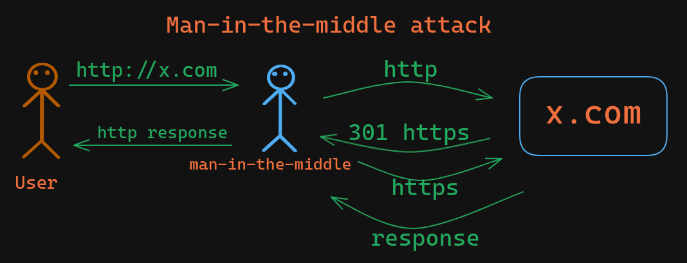
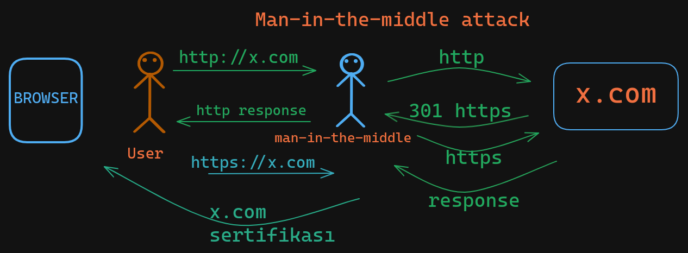
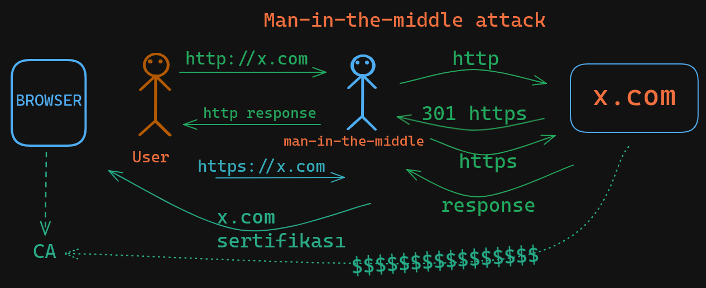
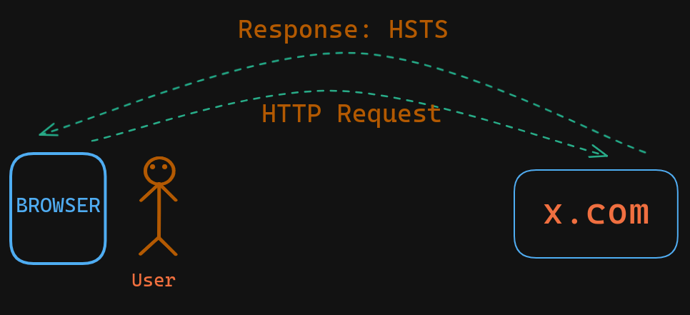

# 0x0E | SSL Temelde Nedir ? HSTS

# SSL (Secure Socket Layer) Temelde Nedir ? HSTS

Aşağıdaki gibi bir yapı düşünelim. Böyle bir durumda ulaşılmaya çalışılan hedef site ile kullanıcı arasında tüm trafiği dinleyen ve bunları yönlendiren bir ortadaki adam mevcuttur. Kullanıcı burada hedef siteye http ile gitmek istediğinde ortadaki adam tüm trafiği açık bir şekilde görüp bu trafiği hedef siteye iletecektir. Hedef site ise https trafiği beklediğini bildirerek bir cevap dönecektir. Bu cevabı alan ortadaki adam halihazırda tüm trafiğe sahip olduğu için bunu https olarak yeniden hedef siteye iletecektir. Https trafiğine karşılık da hedef site bir cevap dönecektir. Bu cevabı alan ortadaki adam da kullanıcıya istediği cevabı tekrar iletebilecektir. Böyle bir durumda hedef sitede SSL olsa bile kullanıcı henüz SSL ile herhangi bir bağlantı kurmamıştır.



Burada iki sorun meydana gelmektedir;

- SSL Upgrade nasıl yapılacak?
- Sistem talebi, default olarak SSL ile nasıl gelecek?

Peki kullanıcımız HTTP yerine HTTPS ile çıkış yaptığı durumda neler olacağını düşünelim. 

Aslında buradaki tüm süreç ve HTTP talepleri Browser tarafından gerçekleşir. HTTPS ile trafiğe çıkıldığında Browser SSL ile konuşmak isteyecektir. Dolayısıyla [x.com](http://x.com) sertifikasını browser’a sunmak zorundadır. Browser da bu sertifikanın doğru olup olmadığını kontrol edecek. Dolayısıyla ortadaki adamın x.com sertifikasını browser’a sunması gerekir. 



Bu noktada ortadaki adam istediği şekilde bir sertifika üretebilir;

[yardımcı kaynak](https://stackoverflow.com/questions/10175812/how-to-generate-a-self-signed-ssl-certificate-using-openssl)

```php
openssl req -x509 -newkey rsa:4096 -keyout key.pem -out cert.pem -sha256 -days 365
```

Herhangi bir domain için ssl sertifikası üretebiliyorsak bu mekanizmanın hiçbir zaman çalışmaması gerekiyor. Demek ki eksik bir şeyler var hala. 

Demek ki Browser’ın aldığı sertifikayı doğrulaması gerekmektedir. Bunu da CA (**Certificate authority**) sağlamaktadır. [X.com](http://X.com) sitesinin de bu CA ile iletişim ve anlaşma halinde olması gerekmektedir. 

[X.com](http://X.com) sahibi yeni bir sertifika üretip gerekli ücret karşılığında CA otoritelerine bu sertifikayı imzalatmaktadır. Burada CA tarafından imzalanan sertifikalar da sitenin sunucusuna yüklenir. Tüm tarayıcı hizmetlerinde de (Firefox, Opera, Chrome …) güvendikleri Sertifika Otoritelerinin (CA) listesi bulunmaktadır. Tarayıcılar da kendilerine gelen sertifikaların burada güvendikleri CA tarafından imzalanmış olmasını beklemektedir. 



Peki CA buradaki sertifikaları nasıl imzalamaktadır ? Ortadaki adam da imzalayamaz mı?

Eğer burada ortadaki adam da gerekli ücret karşılığında sertifikayı imzalatabiliyorsa SSL diye bir şeye hiç gerek kalmayacaktır. Dolayısıyla CA burada domain bazlı doğrulamasını sağlamak zorundadır.

Peki CA bu doğrulamayı nasıl yapar?

[X.com](http://X.com) gelip sertifikasını imzalatmak istediğinde CA’nın birkaç yöntemi bulunmaktadır. 

1. Bazı durumlarda CA sertifikayı imzalar ancak bunu doğrudan geri vermez. Bu sertifikayı örneğin info@x.com adresine göndereceğini belirtir. Dolayısıyla bu domain eğer sizinse bu e-posta adresine de giriş yaparak imzalanmış domaininizi alabilirsiniz. Bu da şu anlama gelir; eğer x.com’un mail sunucusunu hack’lerseniz  herhangi bir CA tarafından belirli bir ücret karşılığında istediğiniz sertifikayı imzalatabilirsiniz. 
2. Başka bir CA örneğin `x.com/cokgizlidosya.txt` adresine GET talebi atacağını söyler, eğer gerçekten bu domain’in sahibiyseniz ilgili path’e bir dosya koyabileceğinizi düşünmektedir. Henüz bizde SSL yokken bu adrese nasıl güvenli bir şekilde geleceği de ayrı bir soru işaretidir burada. 

Şu tarz bir problemimiz mevcuttur, eğer kullanıcı SSL ile trafiğe çıkmazsa ortadaki adamdan dolayı SSL’e hiçbir zaman ulaşamamaktadır. Bu eskiden `sslstrip` ile yapılmaktaydı. İlk request’in http gelmesi beklenirdi, aynı request’leri https ile hedefe gönderip gelen cevapların da tamamını http’ye çevirerek kullanıcıya geri aktarmak mümkündü. Günümüzde ise bunu çözmenin yolları bulunmaktadır. Bir bilgisayardan çıkan request’in default olarak HTTPS ile çıkması istenebilir ve bu mümkündür. Bu da `HTTP Strict Transport Security (HSTS)` ile sağlanmaktadır. 

# HSTS (HTTP Strict Transport Security)

Yukarıda anlattığımız sistemde ortadaki adamın olmadığını düşünecek olursak kullanıcı yani borowser tarafından gönderilen bir HTTP request’ine cevap olarak hedef siteden gelen response’da HSTS header’ı bulunuyorsa artık bu siteye gidecek olan tüm trafik HTTPS olarak gitmek zorundadır. Browser artık bu bilgiyi kaydeder ve her zaman HTTPS ile gideceğini bilir. 



Siz artık bir siteyi HTTP ile ziyaret ettiğinizde bile eğer daha önce HSTS header’ı kayıtlı ise henüz oraya HTTP ile gitmeden HTTPS ile ulaşmış olursunuz. Browser bunu kaydettiği için 307 internal rediret ile sizi hedefe HTTPS ile ulaştırır. 

## HSTS Preload

Peki bir web sitesini ilk defa ziyaret ederken ortada bir adam varsa ne olur? Henüz HSTS kayıtlı değilken HTTP ile gitmek istediğimizde ortadaki adam saldırısından etkilenir miyiz?

Bu sorun da HSTS Preload sayesinde çözülür. 

HSTS Preload, web tarayıcılarına önceden belirlenmiş bir liste üzerinden sitelerin HSTS politikalarını yüklemelerine izin verir. Bu liste, browser üreticileri tarafından yönetilen bir güvenlik özelliğidir. Bir web sitesi, HSTS Preload listesine eklenirse, browser’lar bu siteye erişirken HTTP bağlantılarını otomatik olarak HTTPS'ye yönlendirecek ve kullanıcıları güvenli bir bağlantı üzerinden siteye ulaşmaya zorlayacaktır. HSTS Preload kullanmak, man-in-the-middle saldırılarına karşı daha etkili bir koruma sağlar ve kullanıcıların güvenli bir bağlantı üzerinden iletişim kurmalarını sağlar.

Bu listeye eklenebilmeniz için de aşağıdaki gibi bir yapıya sahip olmanız gerekmektedir. 

```markup
strict-transport-security: max-age=15552000; includeSubDomains; preload
```


## KAYNAKLAR:

1. [https://www.youtube.com/watch?v=XlgG-Aw2nos](https://www.youtube.com/watch?v=XlgG-Aw2nos&list=PLwP4ObPL5GY940XhCtAykxLxLEOKCu0nT&index=15)
2. [https://www.mehmetince.net/namecheap-xss-vulnerability-via-ssl-certificate/](https://www.mehmetince.net/namecheap-xss-vulnerability-via-ssl-certificate/)
3. [https://arstechnica.com/information-technology/2013/01/turkish-government-agency-spoofed-google-certificate-accidentally/](https://arstechnica.com/information-technology/2013/01/turkish-government-agency-spoofed-google-certificate-accidentally/)
4.
