# 0x1A | OAuth Zafiyetleri

## OAuth Zafiyetinin Temel Hikayesi

OAuth (Open Authorization), kullanıcıların bir hizmete üçüncü bir uygulama veya hizmet üzerinden erişim yetkisi vermesini sağlayan bir yetkilendirme protokolüdür. Özellikle web ve mobil uygulamalar arasında kullanılır. Örneğin, bir kullanıcı bir web sitesine Facebook veya Google hesabıyla giriş yaparken OAuth protokolü kullanılabilir.

OAuth, kullanıcının kimlik bilgilerini (örneğin, kullanıcı adı ve şifresi) bir uygulamaya vermesini gerektirmez. Bunun yerine, yetkilendirme sunucusu (authorization server) ve kaynak sunucu (resource server) arasında güvenli bir şekilde erişim tokenleri paylaşılır. Bu tokenler, üçüncü taraf uygulamaların belirli kaynaklara (örneğin, kullanıcının profil bilgilerine veya fotoğraflarına) erişimini sağlar.

OAuth protokolü, güvenli bir yetkilendirme süreci sağlar ve kullanıcıların gizli bilgilerini güvende tutar. Bununla birlikte, OAuth'ın yanlış yapılandırılması veya hatalı uygulanması durumunda güvenlik riskleri ortaya çıkabilir. Bu nedenle, OAuth protokolünün doğru bir şekilde kullanılması ve güvenlik önlemlerinin alınması önemlidir.

Aslına bakarsanız OAuth bir kullanıcının iznini alarak başka bir web sitesindeki bilgisine erişim sağlama imkanı sağlamaktadır. Yani;

Örneğin burada X websitesinin sahibi olduğunuzu düşünün. Sisteminize gelen kullanıcının kayıt işleminde ya da kendisi hakkında herhangi bir bilgi almak istediğinizde form doldurmanız gerekmektedir. Bunu yapmak yerine bu kullanıcının halihazırda facebook üzerinde mevcut bilgileri bulunduğu için kullanıcıyı facebook’a gönderebilir ve facebook’ta birtakım işlemler yaşandıktan sonra kullanıcıyı kendinize geri getirdiğinizde bu bilgilerle gelmesini sağlayabilirsiniz. Böylece kullanıcının sıfırdan onlarca bilgiyi girmesini zorunlu tutmamış olursunuz, e-posta doğrulama süreçlerine girmezsiniz vb. işlemlerden kurtulmuş olursunuz. 

## Bazı Sorunlar:

OAuth içerisinde HTTP’yi düşündüğümüzde aslında birtakım sorunlarla karşılaşmaktayız. 

OAuth, kullanıcıların bir web sitesine (Örneğin, bir hizmet sağlayıcıya) üçüncü parti servisler (Facebook, Google vb. OAuth mekanizmasını sağlayan servisler) üzerinden güvenli bir şekilde erişim sağlamasına olanak tanıyan bir yetkilendirme protokolüdür.

Aşağıdaki şablon üzerinden konuşacak olursak, bir kullanıcının ilk olarak hizmet sağlayıcının web sitesine (X) eriştiğini ve ardından OAuth mekanizmasını kullanan bir servis sağlayıcıyla (Provider) kimlik doğrulaması yapmak için iletişime geçtiğini varsayalım. Kullanıcı, web sitesiyle iletişim kurduğunda, bir HTTP request-response döngüsü gerçekleşir. Bu noktada, web sitesi, kullanıcıyı Provider'a yönlendiren bir HTTP isteğinde bulunur ve böylece yeni bir request-response döngüsü daha başlar.

Web sitesi ile Provider arasındaki iletişim, aynı tarayıcının farklı sekmeleri arasındaki iletişim gibi düşünülebilir. Ancak bu sekmeler arasında doğrudan veri paylaşımı bulunmamaktadır (örneğin, CORS politikaları nedeniyle). Bu nedenle, kullanıcı Provider'da kimlik doğrulama işlemini tamamladıktan sonra, tekrar web sitesine yönlendirilir. Böylece, web sitesi, kullanıcının Provider'da gerekli işlemleri gerçekleştirip geri döndüğünü anlar.

Peki, kullanıcı web sitesine geri döndüğünde, bilgilerin doğrulandığını web sitesi nasıl anlar?

Bu süreçte, Provider, kullanıcıyı web sitesine geri yönlendirirken, request’e özel bir kod ekler. Bu kod, OAuth akışının kritik bir parçasıdır. Provider, bu kodu kullanarak, kimlik doğrulama işleminin başarıyla tamamlandığını ve kullanıcının web sitesine güvenli bir şekilde yönlendirilebileceğini belirtir. Web sitesi daha sonra bu kodu alır ve Provider'a gönderir; Provider ise bu kod sayesinde kullanıcıyı tanır ve gerekli bilgileri web sitesine sağlar. Bu şekilde, kullanıcı temelde Provider'a giderek kimlik doğrulamasını tamamlar ve elde ettiği kodla web sitesine erişim sağlar.

Aslında buradaki kullanıcının temelde yaptığı şey Provider’a gidip authentication’ı tamamlayarak elde ettiği kod ile web sitesine gitmektir. Genel olarak bu şekilde düşünebilirsiniz. 

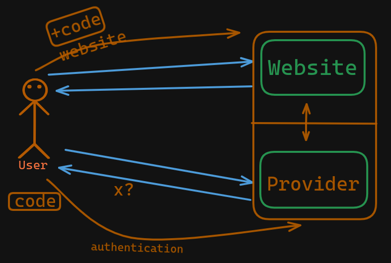

Bu kısma kadar olan süreç ve açıklamalar anlaşıldıysa artık PortSwigger üzerindeki lab ortamlarına bakarak ilerleyebiliriz…

## Lab: Authentication bypass via OAuth implicit flow

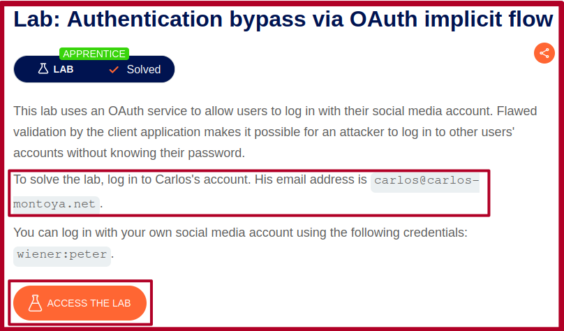

Lab ortamına giriş yapıp sisteme login olmak istediğimizde bizleri sosyal medya ile giriş yapma kısmına yönlendirmektedirler. 

Bu kısımda oluşan request’leri incelediğimizde ise aşağıdaki gibi olduğunu görebiliriz. 

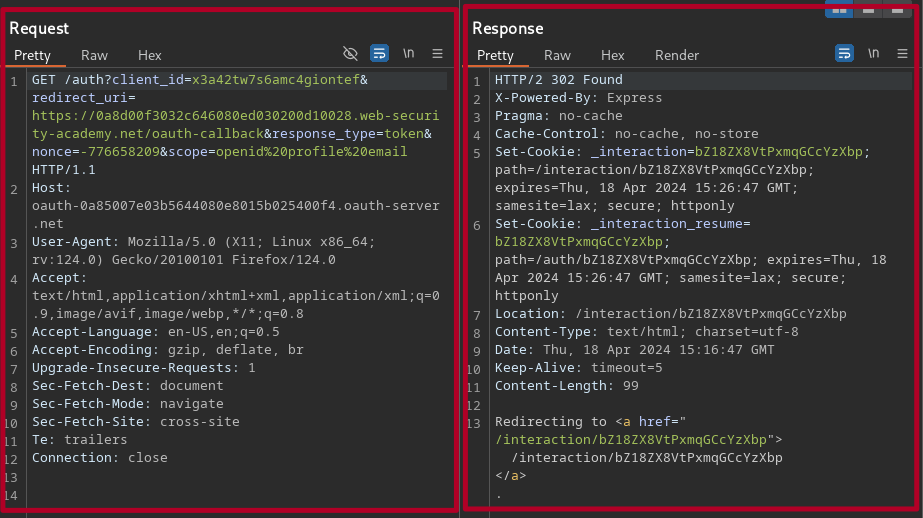

Bu HTTP GET request’i, OAuth protokolü kullanılarak bir kimlik doğrulama sürecini başlatan bir web tarayıcısından gönderilmiş bir request’tir. Request, OAuth 2.0'daki bir kimlik sağlayıcısına (OAuth sunucusuna) yapılmaktadır. Request’teki parametreler ve başlıklar, OAuth protokolünün belirli yönlerini temsil eder:

- **`GET /auth`**: Bu, kimlik doğrulama endpoint'ine yapılan bir GET request’idir.
- **`client_id`**: Bu, OAuth protokolünü kullanan uygulamanın kimlik sağlayıcıya tanımlanması için kullanılır. Bu değer, uygulamanın OAuth sunucusu üzerinde kayıtlı olduğunu ve kimlik doğrulama isteğinin gönderilmesine izin verildiğini belirtir.
- **`redirect_uri`**: Bu, kullanıcının kimlik doğrulama işlemi tamamlandıktan sonra yönlendirileceği URL'dir. İşlem başarılıysa veya hata olursa, kimlik sağlayıcı bu URI'ye bir yanıt gönderir.
- **`response_type=token`**: Bu, uygulamanın, kullanıcıyı doğruladıktan sonra bir erişim token'ı almak istediğini belirtir. Bu durumda, token doğrudan tarayıcı üzerinden alınır, genellikle bir fragment (URL'nin **`#`** işaretinden sonra gelen kısım) olarak.
- **`nonce`**: Bu, her bir isteğin tekil olmasını sağlamak için kullanılan rastgele oluşturulmuş bir sayıdır. Bu sayı ayrıca CSRF (Cross-Site Request Forgery) saldırılarına karşı koruma sağlar.
- **`scope`**: Bu, uygulamanın kullanıcı bilgilerine erişim düzeyini belirtir. Örneğin, **`openid profile email`** demek, uygulamanın kullanıcının kimliği, profil bilgileri ve e-posta adresine erişmek istediği anlamına gelir.
- Diğer HTTP başlıkları (User-Agent, Accept, Accept-Language, vb.) standart web tarayıcı istek başlıklarıdır ve tarayıcının isteği nasıl işlemesi gerektiği, kabul edilen içerik tipleri, dil tercihleri, kodlama yöntemleri gibi bilgileri içerir.
- **`Sec-Fetch-*`** başlıkları, tarayıcının Fetch API güvenlik politikasıyla ilgili bilgiler içerir.
- **`Connection: close`**: Bu, sunucunun isteği işledikten sonra bağlantıyı kapatması gerektiğini belirtir.

Özetle bu request, OAuth akışının bir parçası olarak yapılan ve kullanıcıya ait tarayıcı tarafından başlatılan bir kimlik doğrulama sürecini yansıtır. Kullanıcının kimliğini doğruladıktan sonra, OAuth sunucusu **`redirect_uri`** üzerinden tarayıcıya bir yanıt gönderecek ve bu yanıtta **`token`** yer alabilir. Bu token, uygulamanın daha sonraki isteklerinde kullanıcının kimliğini doğrulamak için kullanılır.

Bu kısımdan sonra bizden onay istenen bir seçenek daha çıkmaktadır. Hangi bilgilerimizin paylaşılacağıyla ilgili bir onay istenmektedir. 

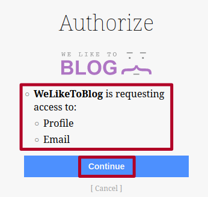

Burada devam edip request’leri incelediğimizde aşağıdaki request’e ulaşmaktayız.

Bu kısımda büyük bir sorun bulunmaktadır. Düzgün tasarlanmamış bir mimariden dolayı burada başka bir mail adresiyle oturum açma işlemini tamamlayarak ilerleyebiliriz. 

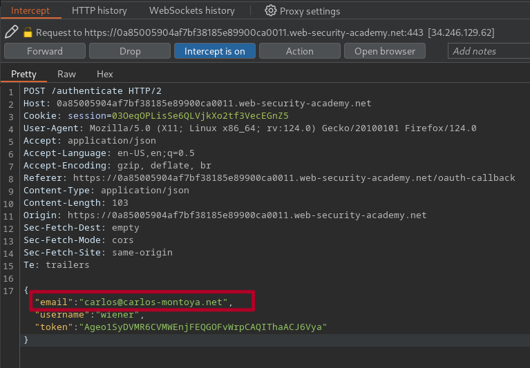

Dolayısıyla lab da çözülmüş oldu…

## Lab: Forced OAuth profile linking

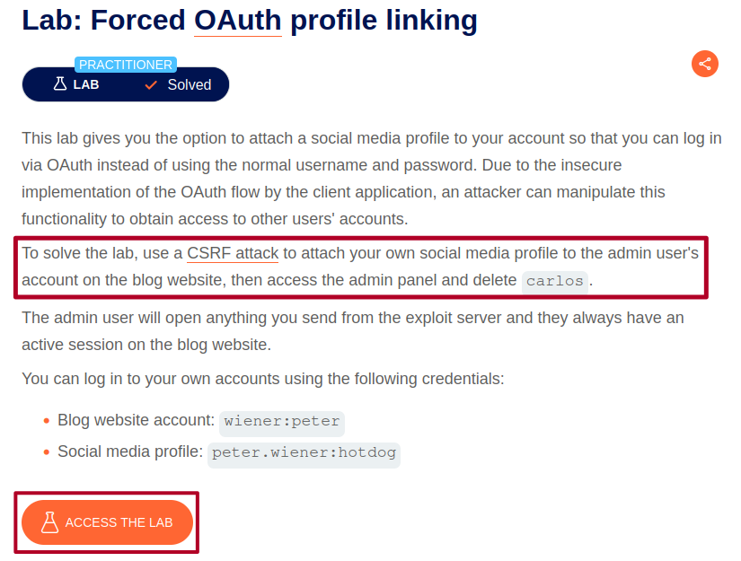

Lab ortamına giriş yaptıktan sonra öncelikle authentication işlemlerini tamamlıyoruz.

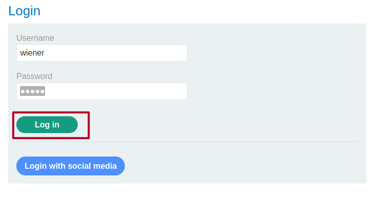

Giriş işlemlerini bitirdikten sonra ise `“Attach a social profile”` özelliği ile yani hesabımızı bir sosyal medya hesabı ekleme özelliğiyle karşılaşıyoruz.

Artık bu kısım için login işlemlerini tamamlamalıyız. 

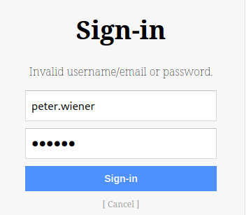

Ardından da tekrar hangi bilgilerimizi paylaşacağını teyit etmektedir. 

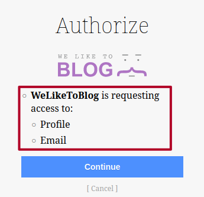

Buradan sonra işlemler tamamlanmadan önce request’i dropluyoruz. Elde ettiğimiz URL’i Exploit Server’da kullanmak üzere kopyalıyoruz.

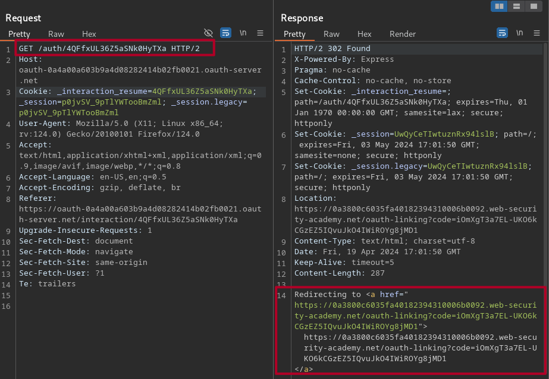

Yani burada oluşan URL’i web sitesine geri dönmeden durdurup kopyalıyoruz. Çünkü buradaki web sitesi URL’i kendi hesabımıza eşleştirmek isteyecektir, biz bunun yerine  admin hesabına eşleştireceği biçimde kullanacağız. 

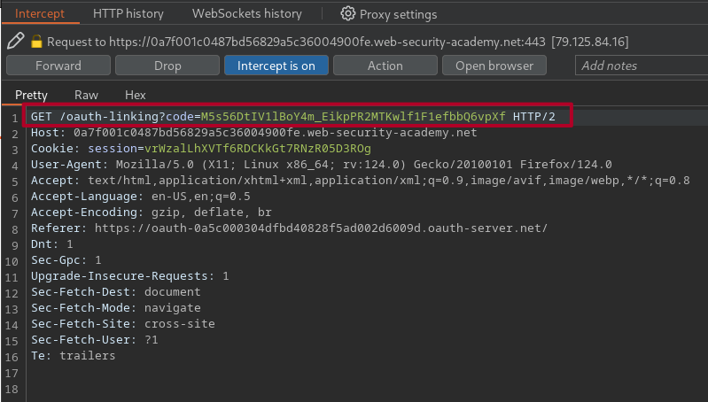

Kopyaladığımız bu URL’i exploit server üzerinde kullanıyoruz. 

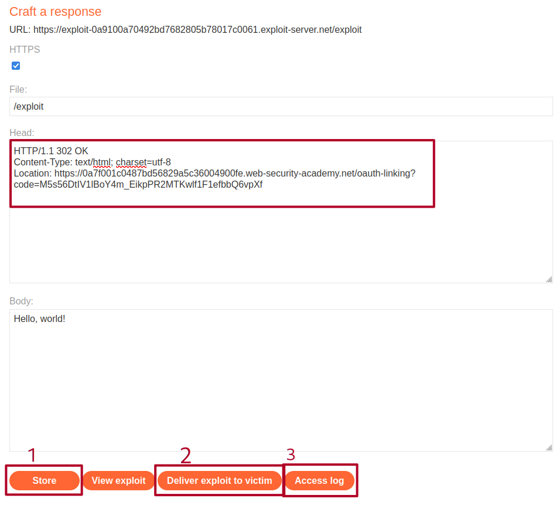

Artık bu aşamadan sonra yaptığımız işlemin başarıyla gerçekleştiğini görebiliriz. 

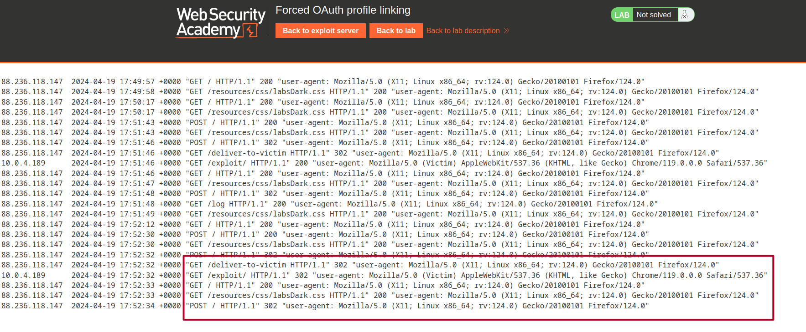

Bu kısımdan sonra artık sistemden çıkış yapıp Sosyal Medya ile Giriş yapmamız gerekmektedir. Çünkü admin hesabı ile ilişkilendirilmiş durumdadır. 

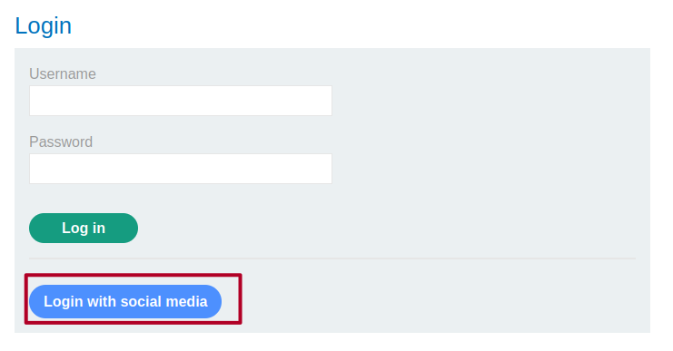

Artık admin panel’e erişebildiğimizi görmekteyiz.

Carlos kullanıcısını silebiliriz.

Ve lab ortamı çözülmüş oldu…

## Lab: OAuth account hijacking via redirect_uri

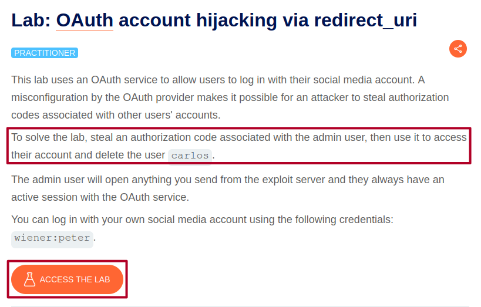

Bu kısımda da redirect_uri üzerinde bir manipülasyon yaparak ilerleyeceğiz. 

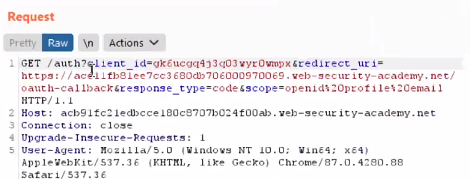

Başka bir adres vermemize rağmen sistem ilerlemeye devam ediyorsa bu bir güvenlik sorunu oluşturabilir.

Exploit server üzerinde redirect edilecek olan adresi hacker’a ait olan adres ile değiştiriyoruz. Eğer tüm işlemler bittikten sonra bizim verdiğimiz adrese gelirse kod ile gelecektir. 

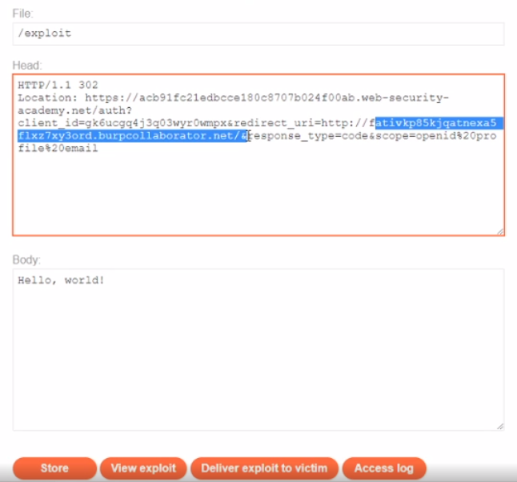

Artık hacker istediği kodu elde etmiş olur. 

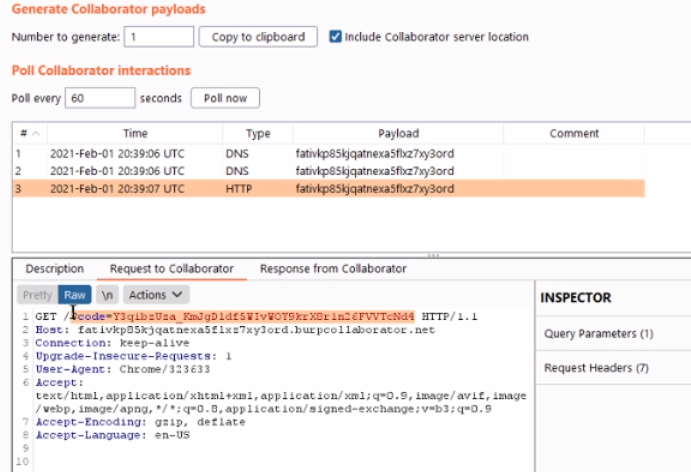

Dolayısıyla sosyal medya eşleştirme işlemi tamamlanmadan önce bu kodu yerleştirerek admin hesabı ile eşleştirmiş olur. 

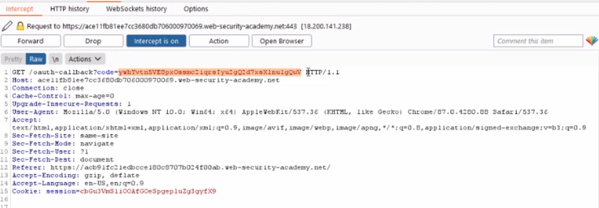

Artık admin olduğumuz için carlos kullanıcısını da silebiliriz. 

Ve lab çözülmüş olur…

## Kaynaklar:

1. [https://www.youtube.com/watch?v=R8K6e-oTmwo](https://www.youtube.com/watch?v=R8K6e-oTmwo)

##
