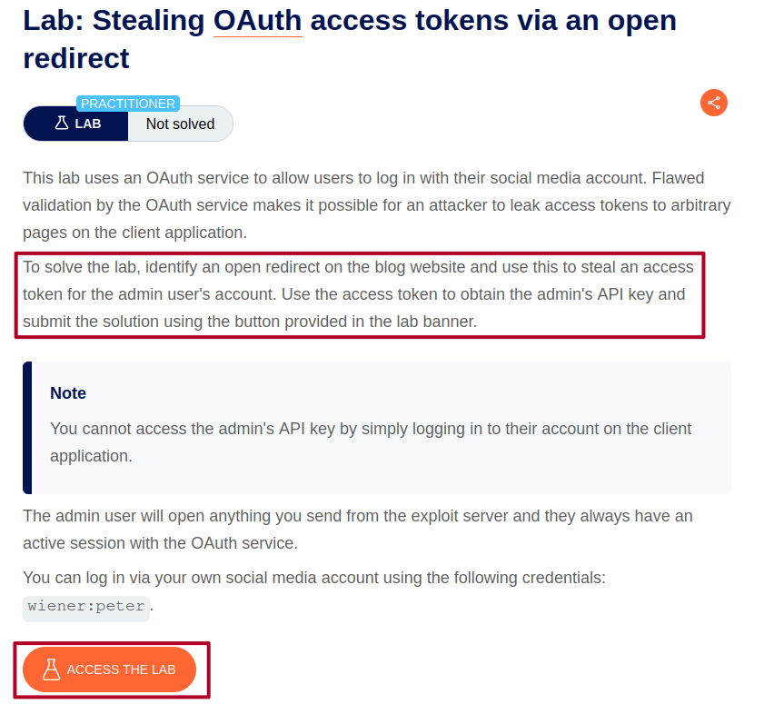
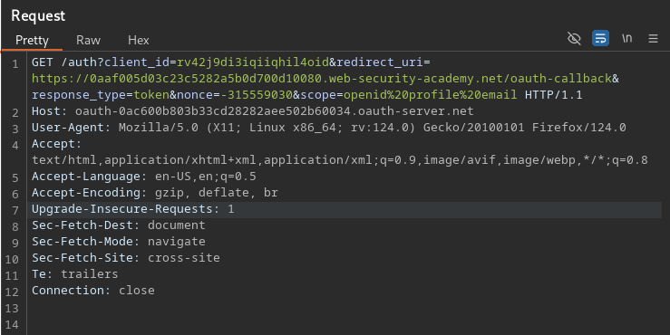
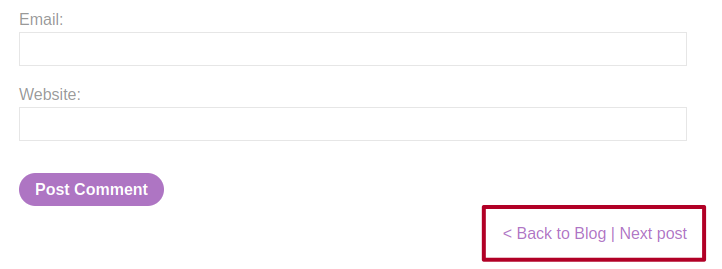
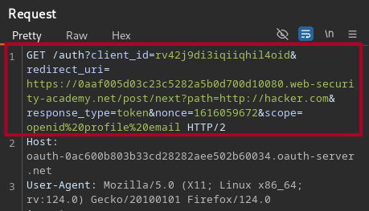
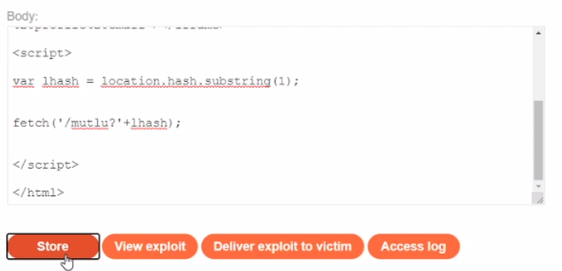
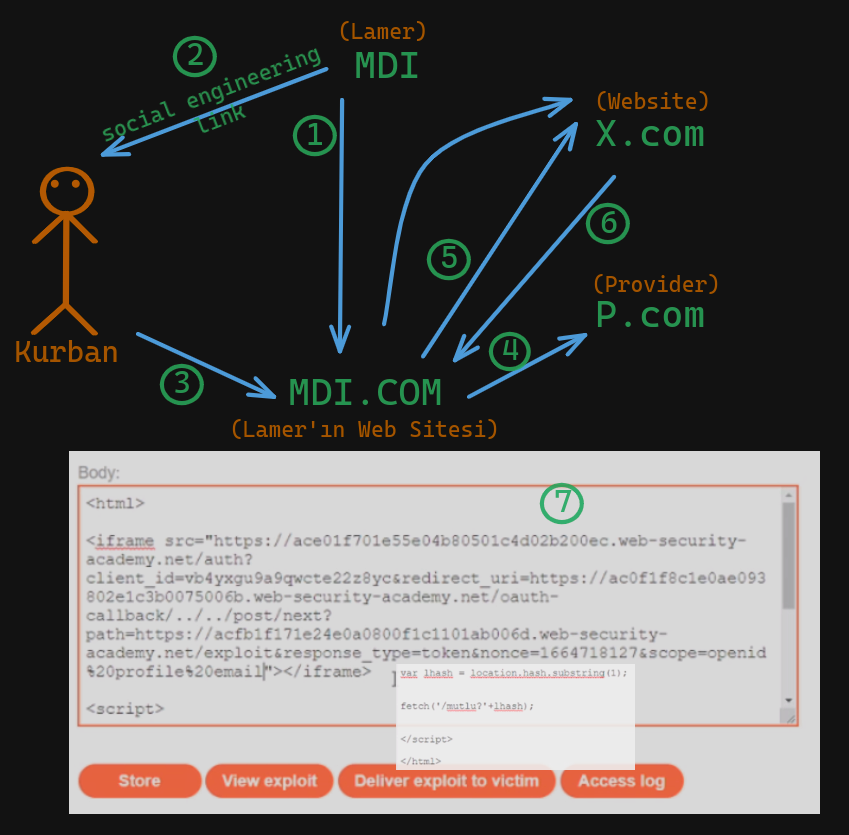
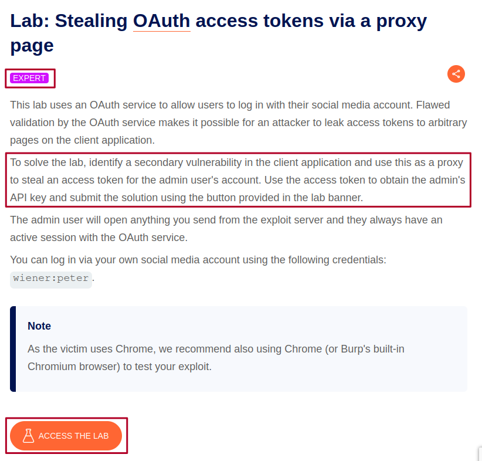
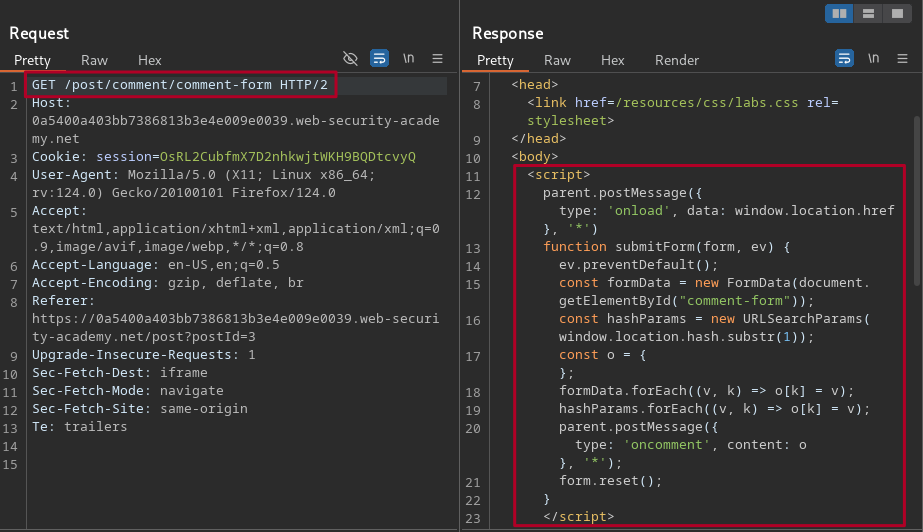
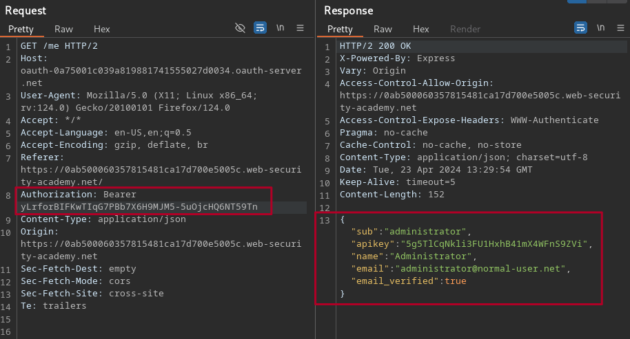
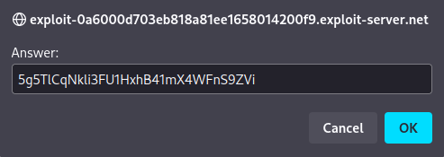

# 0x1B | OAuth Zafiyetleri Reloaded

# Lab: Stealing OAuth access tokens via an open redirect



Lab ortamına erişip giriş yapmak istediğimizde başlangıçta aşağıdaki gibi bir request ile ilerlemekteyiz.



Buradaki request’i öneminden dolayı daha ayrıntılı bir şekilde açıklayarak ele alabiliriz;

### **Metot ve URL**

- **Metot/Protokol**: **`GET`**
- **Endpoint**: **`/auth`**
- **Sorgu Parametreleri**:
    - **`client_id=rv42j9di3iqiiqhil4oid`**: Uygulamanın OAuth yetkilendirme sunucusu tarafından tanınması için verilmiş benzersiz kimlik.
    - **`redirect_uri=https://0aaf005d03c23c5282a5b0d700d10080.web-security-academy.net/oauth-callback`**: Erişim tokenının gönderileceği uygulamanın yönlendirme URI'si. Bu URL, yetkilendirme sunucusu tarafından onaylanmış olmalıdır, aksi takdirde güvenlik açıklarına yol açabilir.
    - **`response_type=token`**: Uygulamanın "token" tipinde bir cevap beklediği, bu durumda tokenın tarayıcı üzerinden açıkça erişilebilir olacağı implicit akışını işaret eder.
    - **`nonce=-315559030`**: Tekrarlanan istekleri önlemek ve cevapların sadece bir kere kullanıldığını garantilemek için kullanılan rastgele sayı.
    - **`scope=openid%20profile%20email`**: Kullanıcıdan istenen bilgilere erişim izni.

### **Host ve Diğer Başlıklar**

- **Host**: **`oauth-0ac600b803b33cd28282aee502b60034.oauth-server.net`** - Yetkilendirme sunucusunun adı.
- **User-Agent**: Kullanılan tarayıcı ve işletim sistemi bilgisi.
- **Accept-Language**, **Accept-Encoding**, ve diğer başlıklar: İstemci tarafından kabul edilen içerik türleri ve dil tercihleri gibi ek bilgiler.

### **Potansiyel Zafiyetler ve Güvenlik Endişeleri**

1. **Redirect URI Güvenliği**: **`redirect_uri`** parametresi, saldırganlar tarafından manipüle edilebilir ise "open redirect" zafiyetlerine yol açabilir. Bu parametrenin yetkilendirme sunucusu tarafından doğrulanan bir liste ile sınırlı olması önemlidir.
2. **Implicit Flow Kullanımı**: **`response_type=token`** kullanımı, erişim tokenının tarayıcı tarafından direkt olarak elde edilmesini sağlar ki bu da XSS gibi saldırılara karşı tokenın daha savunmasız olmasına neden olur. Daha güvenli bir alternatif olarak "authorization code" akışı tercih edilebilir.
3. **State ve Nonce Kullanımı**: **`nonce`** parametresi CSRF saldırılarına karşı bir önlem olarak kullanılıyor olabilir, fakat aynı zamanda **`state`** parametresinin de eklenmesi yararlı olacaktır. **`state`** parametresi, client tarafından başlatılan isteğin yanıtını doğrulamak için kullanılır ve CSRF saldırılarına karşı koruma sağlar.
4. **Erişim Kapsamı (Scope)**: Verilen **`scope`** parametresi (**`openid profile email`**), kullanıcının kimlik doğrulama bilgilerine ve kişisel bilgilerine geniş erişim izni vermektedir. Kullanılan izinlerin ve verilen erişimin dikkatlice kontrol edilmesi gerekmektedir.

Bu kısımda ilerleyebilmek için `Open Redirect` zafiyeti bulmamız gerekmektedir. 

Bu yüzden sistemin başka kısımlarını da inceleyip öncelikle bu zafiyeti bulmamız gerekiyor. Bir blog yazısına girip en alt kısma geldiğimizde önceki ve sonraki blog yazılarına gidebildiğimizi görmekteyiz.



Burada yaşanan request-response döngüsünü inceleyerek ilerleyebiliriz.


Burada path olarak verdiğimiz her ifade geçerli kabul edilmektedir. 


Dolayısıyla bu kısımda oluşan URL’i kopyalayıp bir önceki request’te ilgili yerde kullanmalıyız. 

```html
https://0aaf005d03c23c5282a5b0d700d10080.web-security-academy.net/post/next?path=http://hacker.com
```

Yani bu adresi ziyaret eden kişi hacker.com’u ziyaret eder. Bu URL’i de asıl hedefimize yerleştirdiğimizde hem bir engellemeye takılmamış oluruz hem de istediğimiz adrese redirecting işlemini gerçekleştirmiş oluruz. 



Dolayısıyla burada Burp Collabrator ile elde ettiğimiz adresi yerleştirerek ilerleyebiliriz.


Ancak bu şekilde ilerlediğimizde sistem bunu kabul etmemektedir. 


Sistemdeki validation’ı atlatmak için mevcut URL’e ek olark kök dizine çıkıp daha sonra istediğimiz path’i verebilmekteyiz.


Dolayısıyla artık biz sistemde Hacker’a ait olan domain’i yerleştirip  ilerlediğimizde, authentication işlemlerini tamamlayıp redirecting yapılan yere gelmekteyiz.


Response olarak da Hacker’a ait olan sunucuya gidildiğini görebiliriz.


Ancak burada locatin hash üzerinden ilerlediğini görmekteyiz. Dolayısıyla token sadece broswer’da kalır, sunucuya gelmez. 


Yani hacker’a yönlendirdikten sonra locatin hash üzerinden bu değeri almamız gerekmektedir. Bunu da JavaScript ile sağlayabiliriz. 




Ve başarılı…


Burada elde ettiğimiz token ile sisteme giriş yapmalıyız.

Bu değer de admin hesabına giriş yaptığımız esnada response’ta yer almaktadır. 


Bu değeri lab ortamında submit to solution’a verdiğimizde lab çözülmüş olur…

# Lab Çözümü Özet

1. MDI kendisine ait web sitesine bir HTML içeriği koyar. Koyulan HTML içeriği iframe ile Provider’a yönlendirme işlemi yapmaktadır. Aynı sayfada da sayfadaki location hash’i alıp kendisine gönderen bir kod bloğu bulunmaktadır. Location hash browser’da kalan bir data olduğu için bu yöntem ile access log’lara yazdırmak hedeflenmektedir. 
2. Daha sonra sosyal mühendislik yöntemleri ile MDI tarafından kendi sitesi hedef kullanıcıya gönderilmektedir. 
3. Kurban ise bu link’e tıkladığında oluşturulan HTML içeriği ile karşılaşmaktadır. 
4. Kurban bu link’e tıkladığında buradaki HTML içerik de bahsettiğimiz üzere Provider’a yönlendirme yapmakta ve location hash bilgisini de access log’lara işlemektedir. 
5. Provider tarafına geldiğinde ise kullanıcının authentication’ı halihazırda bulunmaktadır. Provider redirect_uri’a geri yönlendirme yapar. Burada open redirection zafiyeti kullanılarak kurban başka bir adrese yönlendirilir. 
6. 302 redirection yapılır. 
7. Kurban burada artık post next ile belirttiğimiz hacker’a ait olan sunucuya gönderilir. Son olarak artık token vs. ile ilgili bilgiler location hash üzerinden alınarak tekrar kendi sitesine yönlendirilirken access log’a yazılır. 



# Lab: Stealing OAuth access tokens via a proxy page



Lab ortamına eriştikten sonra bize verilen kullanıcı bilgileri ile sisteme giriş yapıyoruz. Bu esnada oluşan request’i inceliyoruz.


Bulacağımız bir open redirect  zafiyeti ile işlemlerimiz daha da kolaylaşabilir. Bu yüzden bu zafiyeti bulabileceğimiz bir kısım ihtiyacımız bulunmaktadır. 

Herhangi bir blog yazısının ayrıntılarına gittiğimizde şu şekilde bir request oluşmaktadır. Bu request’e karşılık oluşan response’a baktığımızda ise bir script’in çalıştığını görebiliriz. 



### **Kod Açıklaması**

1. **PostMessage Kullanımı**:
    
    ```jsx
    javascriptCopy code
    parent.postMessage({type: 'onload', data: window.location.href}, '*')
    
    ```
    
    - Bu satır, içerikli bir iframe içinde çalıştığında ana pencereye bir mesaj gönderir. Mesaj, sayfanın yüklenmesiyle tetiklenir ve sayfanın URL'sini içerir.
    - **`'*'`** argümanı, mesajın hangi kökenden (origin) kabul edileceğini belirtir. Burada, herhangi bir origin için mesaj kabul edileceği belirtilmiştir ki bu bir güvenlik riski oluşturabilir.
2. **Form Gönderme İşlevi**:
    
    ```jsx
    javascriptCopy code
    function submitForm(form, ev) {
        ev.preventDefault();
        const formData = new FormData(document.getElementById("comment-form"));
        const hashParams = new URLSearchParams(window.location.hash.substr(1));
        const o = {};
        formData.forEach((v, k) => o[k] = v);
        hashParams.forEach((v, k) => o[k] = v);
        parent.postMessage({type: 'oncomment', content: o}, '*');
        form.reset();
    }
    
    ```
    
    - **`submitForm`** fonksiyonu, form gönderimi sırasında sayfanın varsayılan gönderim davranışını engeller (**`ev.preventDefault()`**).
    - Formdaki verileri toplar ve URL hash'indeki parametreleri çözümler.
    - Toplanan veriler, ana pencereye **`oncomment`** tipi bir mesaj olarak gönderilir. Bu mesaj, form verilerini ve URL hash parametrelerini içerir.
    - Son olarak, form sıfırlanır (**`form.reset()`**).

Bizim yapılan redirection’lar sonucunda bu sayfaya gelmemiz gerekmektedir. Daha sonra buradaki sorunlardan yararlanarak ilerleyebiliriz. 

Aşağıdaki yapıyı kullanarak başlangıçta bir iframe açarak buradan ilerleyebiliriz.


### **İframe Elementi**

- İframe, bir OAuth yetkilendirme URL'si yükler. Bu URL, kullanıcıdan **`openid`**, **`profile`**, ve **`email`** bilgilerine erişim izni istemek için OAuth yetkilendirme sunucusuna bir istekte bulunur.
- **`redirect_uri`**, OAuth yetkilendirme sunucusunun kullanıcıya ait tokenı göndereceği URL'i belirtir. Burada dikkat çekici olan, **`redirect_uri`**'nin normal bir callback URL yapısından saparak bir yön değiştirme (URL path traversal) yapısı içermesi.

### **Script Elementi**

- **`listener`** adında bir fonksiyon tanımlanmış. Bu fonksiyon, sayfaya gönderilen mesajları dinler (**`window.addEventListener("message", listener, false)`**). Fonksiyon, **`postMessage`** tarafından gönderilen veriyi yakalar.
- Dinlenen mesaj, OAuth işlemi sonucunda elde edilen veriyi içerir. Bu örnekte **`event.data.data.split('#')[1].split('=')[1]`** kullanılarak erişim tokenı çıkarılır.
- Çıkarılan token, sunucuya bir **`fetch`** isteği ile gönderilir. Bu, tokenın kötü niyetli bir sunucuya sızdırılması anlamına gelir.

Bu yapı sayesinde TOKEN bize ulaşmış olur. 


Biz de bu token ile giriş işlemleri esnasında kendi TOKEN’ımızı değiştirerek admin hesabına erişmiş oluruz. 



Buradaki apikey lab çözümü için istenen cevaptır. 



Ve lab çözülmüş olur…


# Kaynaklar:

1. [https://www.youtube.com/watch?v=scs6PJ8qMuw](https://www.youtube.com/watch?v=scs6PJ8qMuw)
2. [https://www.twitch.tv/videos/899706350?filter=all&sort=time](https://www.twitch.tv/videos/899706350?filter=all&sort=time)
